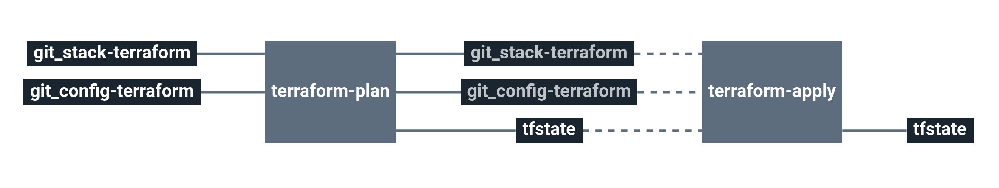

# stack-amazon-elk

Service catalog elk stack

This stack will create an Amazon ELK stack wirh Amazon ElasticSearch + Kibana.

# Architecture

  * **Elasticsearch**: Amazon Elasticsearch Domain

# Requirements

In order to run this task, couple elements are required within the infrastructure:

  * Having a VPC with private & public subnets [here](https://docs.aws.amazon.com/vpc/latest/userguide/getting-started-ipv4.html#getting-started-create-vpc)
  * Having an S3 bucket to store Terraform remote states [here](https://docs.aws.amazon.com/quickstarts/latest/s3backup/step-1-create-bucket.html)

# Details

## Pipeline

> **Note** The pipeline contains a manual approval between terraform plan and terraform apply.
> That means if you trigger a terraform plan, to apply it, you have to go on terraform apply job
> and click on the `+` button to trigger it.

**Jobs description**

  * `terraform-plan`: Terraform job that will simply make a plan of the stack.
  * `terraform-apply`: Terraform job similar to the plan one, but will actually create/update everything that needs to. Please see the plan diff for a better understanding.
  * `terraform-destroy`: :warning: Terraform job meant to destroy the whole stack - **NO CONFIRMATION ASKED**. If triggered, the full project **WILL** be destroyed. Use with caution.

**Params**

|Name|Description|Type|Default|Required|
|---|---|:---:|:---:|:---:|
|`aws_access_key`|Amazon AWS access key for Terraform. See value format [here](https://docs.cycloid.io/advanced-guide/integrate-and-use-cycloid-credentials-manager.html#vault-in-the-pipeline)|`-`|`((aws.access_key))`|`True`|
|`aws_default_region`|Amazon AWS region to use for Terraform.|`-`|`eu-west-1`|`True`|
|`aws_secret_key`|Amazon AWS secret key for Terraform. See value format [here](https://docs.cycloid.io/advanced-guide/integrate-and-use-cycloid-credentials-manager.html#vault-in-the-pipeline)|`-`|`((aws.secret_key))`|`True`|
|`config_git_branch`|Branch of the config git repository.|`-`|`config`|`True`|
|`config_git_private_key`|SSH key pair to fetch the config Git repository.|`-`|`((git_config.ssh_key))`|`True`|
|`config_git_repository`|Git repository URL containing the config of the stack.|`-`|`git@github.com:MyUser/config-lemp-app.git`|`True`|
|`config_terraform_path`|Path of Terraform files in the config git repository|`-`|`($ project $)/terraform/($ environment $)`|`True`|
|`customer`|Name of the Cycloid Organization, used as customer variable name.|`-`|`($ organization_canonical $)`|`True`|
|`env`|Name of the project's environment.|`-`|`($ environment $)`|`True`|
|`project`|Name of the project.|`-`|`($ project $)`|`True`|
|`stack_git_branch`|Branch to use on the public stack Git repository|`-`|`master`|`True`|
|`terraform_storage_bucket_name`|AWS S3 bucket name to store terraform remote state file.|`-`|`($ organization_canonical $)-terraform-remote-state`|`True`|

## Terraform

**Inputs**

|Name|Description|Type|Default|Required|
|---|---|:---:|:---:|:---:|
|`allowed_secgroup`|Security group ID to add to the allowed source_security_group_id of elasticsearch.|`-`|`""`|`False`|
|`es_automated_snapshot_start_hour`|Hour during which the service takes an automated daily snapshot of the indices in the domain.|`-`|`23`|`False`|
|`es_instance_count`|Number of instances in the cluster.|`-`|`1`|`False`|
|`es_instance_type`|Instance type of data nodes in the cluster.|`-`|`t2.small.elasticsearch`|`False`|
|`es_version`|The version of Elasticsearch to deploy.|`-`|`7.1`|`False`|
|`es_volume_size`|The size of EBS volumes attached to data nodes (in GB)|`-`|`15`|`False`|
|`es_zone_awareness_enabled`||`bool`|`false`|`False`|
|`extra_tags`|Dict of extra tags to add on aws resources. format { "foo" = "bar" }.|`-`|`{}`|`False`|
|`subnet_ids`|Subnets to use for Amazon elasticsearch|`list`|``|`True`|
|`vpc_id`|Amazon VPC id on which create each components.|`-`|``|`True`|
|`extra_tags`|Dict of extra tags to add on aws resources. format { "foo" = "bar" }.|`-`|`{}`|`False`|

**Outputs**

| Name | Description |
|------|-------------|
| elasticsearch_domain_endpoint | Domain-specific endpoint used to submit index, search, and data upload requests. |
| elasticsearch_domain_kibana_endpoint | Domain-specific endpoint for kibana without https scheme. |
