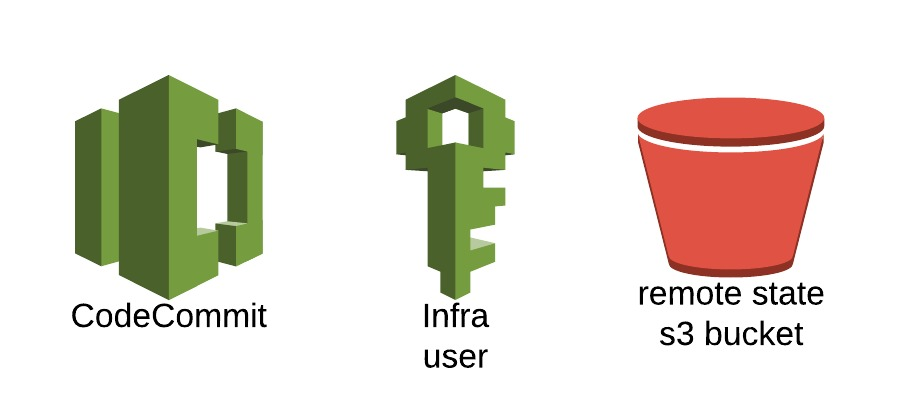
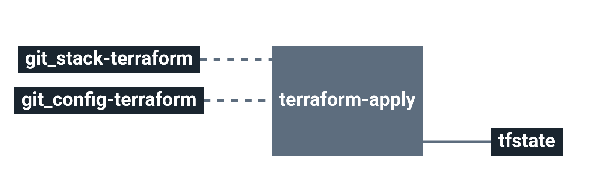

# infra-amazon-req

This module aims to ease the installation of a new infrastructure by giving the possibility to
* Create an S3 bucket for the remote state
* Create an infra user allowed to access such bucket
* Create code commit repository with both admin & read-only users

Each of those component are optional and can be disabled or enabled despite some dependencies.

# Architecture

  * **S3** Amazon Simple Storage Service
  * **IAM** Amazon Identity and Access Management
  * **CodeCommit** Amazon CodeCommit

# Requirements

N/A

# Details

## Pipeline

Because of the very own nature of this stack (likely first one to run), there are some elements to keep in mind. There is no 'plan' via terraform as it couldn't store the planned tfstate into s3 bucket, as it wouldn't exist quite yet. Which is why it only disposes of an 'apply' terraform job instead of both.

**Jobs description**

  * `terraform-apply`: Terraform job similar to the plan one, but will actually create/update everything that needs to.
  * `terraform-destroy`: :warning: Terraform job meant to destroy the whole stack - **NO CONFIRMATION ASKED**. If triggered, the full project **WILL** be destroyed. Use with caution.

**Params**

|Name|Description|Type|Default|Required|
|---|---|:---:|:---:|:---:|
|`aws_access_key`|Amazon AWS access key for Terraform. see value format [Here](https://docs.cycloid.io/advanced-guide/integrate-and-use-cycloid-credentials-manager.html#vault-in-the-pipeline)|`-`|`((aws.access_key))`|`True`|
|`aws_default_region`|Amazon AWS region to use for Terraform.|`-`|`eu-west-1`|`True`|
|`aws_secret_key`|Amazon AWS secret key for Terraform. see value format [Here](https://docs.cycloid.io/advanced-guide/integrate-and-use-cycloid-credentials-manager.html#vault-in-the-pipeline)|`-`|`((aws.secret_key))`|`True`|
|`config_git_branch`|Branch of the config git repository.|`-`|`config`|`True`|
|`config_git_private_key`|SSH key pair to fetch the config git repository.|`-`|`((git_ssh_key.ssh_key))`|`True`|
|`config_git_repository`|Git repository url containing the config of the stack.|`-`|`git@github.com:MyUser/config-req.git`|`True`|
|`customer`|Name of the Cycloid Organization, used as customer variable name.|`-`|`($ organization_canonical $)`|`True`|
|`env`|Name of the project's environment.|`-`|`($ environment $)`|`True`|
|`project`|Name of the project.|`-`|`($ project $)`|`True`|
|`terraform_storage_bucket_name`|AWS S3 bucket name to store terraform remote state file.|`-`|`($ organization_canonical $)-terraform-remote-state`|`True`|
|`terraform_storage_bucket_path`|AWS S3 bucket path to store terraform remote state file.|`-`|`($ project $)/($ environment $)`|`True`|

## Terraform

**Inputs**

|Name|Description|Type|Default|Required|
|---|---|:---:|:---:|:---:|
|`bucket_name`|Specify the S3 bucket name |`-`|`req-terraform-remote-state`|`False`|
|`codecommit_key_public`|Only required when using codecommit - key allowing admin access to the repository|`-`|`""`|`False`|
|`codecommit_readonly_key_public`|Only required when using codecommit - key allowing readonly access to the repository|`-`|`""`|`False`|
|`codecommit_repository_name`|Codecommit repository name to create|`-`|`cycloid-${var.customer}-servicescatalog`|`False`|
|`create_codecommit_repository`|To know if the the codecommit repo has to be created or not|`string`|`"1""`|`False`|
|`create_s3_bucket`|To know if the the S3 bucket has to be created or not|`string`|`"1"`|`False`|
|`force_destroy`|for S3: by default it WILL delete the s3 bucket containing its remote state.|`bool`|`true`|`False`|
|`infra_iam_arn`|If provided this user will be used instead of the created one|`-`|`""`|`False`|
|`suffix`|Extra potential suffix in case of already existing users|`-`|`""`|`False`|

**Outputs**

| Name | Description |
|------|-------------|
| req_codecommit_readonly_username | Codecommit dedicated RO user Username |
| req_codecommit_repository_id | The ID of the repository |
| req_codecommit_ro_user_arn | Codecommit dedicated user ARN |
| req_codecommit_ro_user_id | Codecommit dedicated user ID |
| req_codecommit_username | Codecommit dedicated user Username |
| req_infra_user_arn |  |
| req_infra_user_id |  |
| req_remote_state_bucket_name | The name of the bucket |

