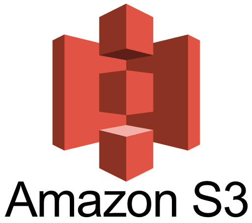
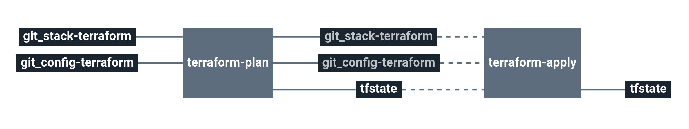

# stack-amazon-s3

Create an Amazon S3 bucket and a dedicated user using Cycloid stacks format.

# Architecture

  * **S3**: Amazon Simple Storage Service
  * **IAM** Identity and Access Management policy

# Requirements

In order to run this task, couple elements are required within the infrastructure:

  * Having an S3 bucket with versioning to store Terraform remote states [here](https://docs.aws.amazon.com/quickstarts/latest/s3backup/step-1-create-bucket.html)

# Details

## Pipeline

> **Note** The pipeline contains a manual approval between `terraform plan` and `terraform apply`.
> That means if you trigger a `terraform plan`, to apply it, you have to go on `terraform apply` job
> and click on the `+` button to trigger it.

**Jobs description**

  * `terraform-plan`: Terraform job that will simply make a plan of the stack.
  * `terraform-apply`: Terraform job similar to the plan one, but will actually create/update everything that needs to. Please see the plan diff for a better understanding.
  * `terraform-destroy`: :warning: Terraform job meant to destroy the whole stack - **NO CONFIRMATION ASKED**. If triggered, the full project **WILL** be destroyed. Use with caution.

**Params**

|Name|Description|Type|Default|Required|
|---|---|:---:|:---:|:---:|
|`aws_access_key`|Amazon AWS access key for Terraform. see value format [Here](https://docs.cycloid.io/advanced-guide/integrate-and-use-cycloid-credentials-manager.html#vault-in-the-pipeline)|`-`|`((aws.access_key))`|`True`|
|`aws_default_region`|Amazon AWS region to use for Terraform.|`-`|`eu-west-1`|`True`|
|`aws_secret_key`|Amazon AWS secret key for Terraform. see value format [Here](https://docs.cycloid.io/advanced-guide/integrate-and-use-cycloid-credentials-manager.html#vault-in-the-pipeline)|`-`|`((aws.secret_key))`|`True`|
|`config_ansible_path`|Path of Ansible files in the config git repository|`-`|`($ project $)/ansible`|`True`|
|`config_git_branch`|Branch of the config git repository.|`-`|`master`|`True`|
|`config_git_private_key`|SSH key pair to fetch the config git repository.|`-`|`((ssh_config.ssh_key))`|`True`|
|`config_git_repository`|Git repository url containing the config of the stack.|`-`|`git@github.com:MyUser/config-s3.git`|`True`|
|`config_terraform_path`|Path of Terraform files in the config git repository|`-`|`($ project $)/terraform/($ environment $)`|`True`|
|`customer`|Name of the Cycloid Organization, used as customer variable name.|`-`|`($ organization_canonical $)`|`True`|
|`env`|Name of the project's environment.|`-`|`($ environment $)`|`True`|
|`project`|Name of the project.|`-`|`($ project $)`|`True`|
|`stack_git_branch`|Branch to use on the public stack git repository|`-`|`master`|`True`|
|`terraform_storage_bucket_name`|AWS S3 bucket name to store terraform remote state file.|`-`|`($ organization_canonical $)-terraform-remote-state`|`True`|
|`terraform_storage_bucket_path`|AWS S3 bucket path to store terraform remote state file.|`-`|`($ project $)/($ environment $)`|`True`|

## Terraform

**Inputs**

|Name|Description|Type|Default|Required|
|---|---|:---:|:---:|:---:|
|`bucket_acl`|S3 Canned ACL : https://docs.aws.amazon.com/AmazonS3/latest/dev/acl-overview.html#canned-acl|`-`|`private`|`False`|
|`bucket_name`|Name of the S3 bvcket to create. Only lowercase alphanumeric characters and hyphens allowed|`-`|``|`True`|
|`extra_tags`|Dict of extra tags to add on aws resources. format { "foo" = "bar" }.|`-`|`{}`|`False`|
|`versioning_enabled`|Enable S3 bucket versionning|`bool`|`false`|`False`|

**Outputs**

| Name | Description |
|------|-------------|
| iam_s3_key | IAM access key dedicated to the S3 bucket access |
| iam_s3_secret | IAM secret key dedicated to the S3 bucket access |
| s3_id | S3 bucket name |
