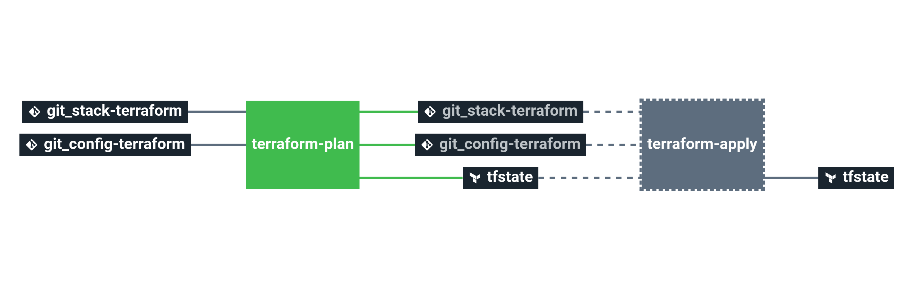

# Stack-compute

This stack enables the deployment and configuration of a compute instance in one of the available providers.

It allows to configure the Virtual Machine's **definitions**, **OS**, **volume**, **network** and **security**.

To ease the use of the stack, there's a pre-configured ssh access rule that can be disabled in all the providers that can be changed or disabled.

# Details

## Pipeline

> **Note** The pipeline contains a manual approval between terraform plan and terraform apply.
> That means if you trigger a terraform plan, to apply it, you have to go on terraform apply job
> and click on the `+` button to trigger it.

**Jobs description**

  * `terraform-plan`: Terraform job that will simply make a plan of the stack.
  * `terraform-apply`: Terraform job similar to the plan one, but will actually create/update everything that needs to. Please see the plan diff for a better understanding.
  * `terraform-destroy`: :warning: Terraform job meant to destroy the whole stack - **NO CONFIRMATION ASKED**. If triggered, the full project **WILL** be destroyed. Use with caution.

## Available providers

Depending on the provider different parameters and requirements may apply, please refer to the correspondent README page:

- [aws](AWS_README.md): Create a EC2 instance

- [azure](AZURE_README.md): Creates a linux virtual machine

- [gcp](GCP_README.md): Creates a GCE instance
