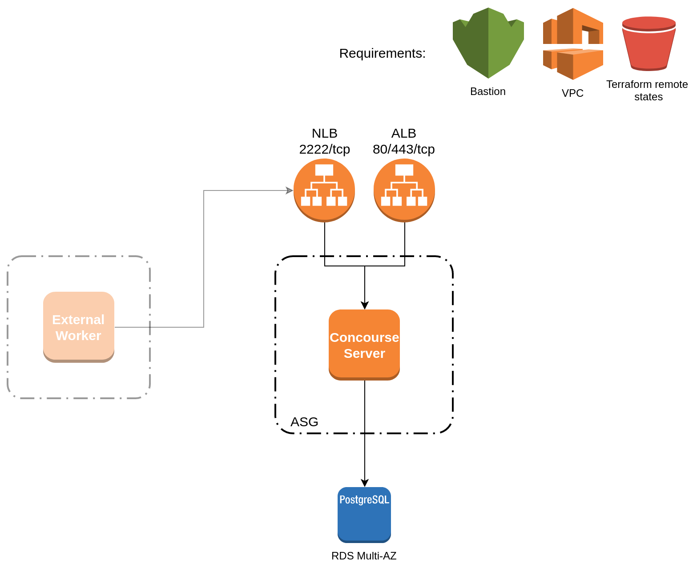
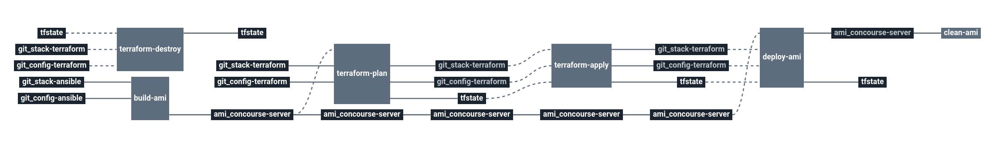

# stack-concourse-server

Concourse is an open-source continuous thing-doer.
Built on the simple mechanics of resources, tasks, and jobs. Concourse presents a general approach to automation that makes it great for CI/CD.

# Architecture

This stack will deploy a Concourse server (web+atc) on an Amazon EC2 instance behind ALB/NLB loadbalancers, using PostgreSQL for Cycloid.io.

  * **ALB**: Amazon application loadbalancer
  * **NLB**: Amazon network loadbalancer
  * **ASG**: Autoscaling group for fronts
  * **concourse-server**: EC2 instances from builded AMI
  * **RDS**: Amazon RDS database (PostgreSQL)

# Requirements

In order to run this task, couple elements are required within the infrastructure:

  * Having a VPC with private & public subnets [here](https://docs.aws.amazon.com/vpc/latest/userguide/getting-started-ipv4.html#getting-started-create-vpc)
  * Having an S3 bucket to store Terraform remote states [here](https://docs.aws.amazon.com/quickstarts/latest/s3backup/step-1-create-bucket.html)

# Details

## Pipeline

> **Note** The pipeline contains a manual approval between terraform plan and terraform apply.
> That means if you trigger a terraform plan, to apply it, you have to go on terraform apply job
> and click on the `+` button to trigger it.

**Jobs description**

  * `terraform-plan`: Terraform job that will simply make a plan of the stack.
  * `terraform-apply`: Terraform job similar to the plan one, but will actually create/update everything that needs to. Please see the plan diff for a better understanding.
  * `terraform-destroy`: :warning: Terraform job meant to destroy the whole stack - **NO CONFIRMATION ASKED**. If triggered, the full project **WILL** be destroyed. Use with caution.
  * `build-ami` : Build Concourse server Amazon image AMI using Packer and Ansible.
  * `clean-ami` : Remove old AMI of Cycloid workers.

**Params**

|Name|Description|Type|Default|Required|
|---|---|:---:|:---:|:---:|
|`aws_access_key`|Amazon AWS access key for Terraform. see value format [here](https://docs.cycloid.io/advanced-guide/integrate-and-use-cycloid-credentials-manager.html#vault-in-the-pipeline)|`-`|`((aws.access_key))`|`True`|
|`aws_default_region`|Amazon AWS region to use for Terraform.|`-`|`eu-west-1`|`True`|
|`aws_secret_key`|Amazon AWS secret key for Terraform. see value format [here](https://docs.cycloid.io/advanced-guide/integrate-and-use-cycloid-credentials-manager.html#vault-in-the-pipeline)|`-`|`((aws.secret_key))`|`True`|
|`concourse_server_creds`|Cycloid raw credential name containing Concourse keys. Expected fields `basic_auth_user`, `basic_auth_password`, `session_signing_key`, `tsa_host_key`, `vault_role_id` and `vault_secret_id`|`-`|`raw_concourse_server_creds`|`True`|
|`config_ansible_path`|Path of Ansible files in the config git repository|`-`|`($ project $)/ansible`|`True`|
|`config_git_branch`|Branch of the config git repository.|`-`|`master`|`True`|
|`config_git_private_key`|SSH key pair to fetch the config git repository.|`-`|`((git_codecommit_readonly.ssh_key))`|`True`|
|`config_git_repository`|Git repository url containing the config of the stack.|`-`|`git@github.com:MyUser/config-concourse-server.git`|`True`|
|`config_terraform_path`|Path of Terraform files in the config git repository|`-`|`($ project $)/terraform/($ environment $)`|`True`|
|`customer`|Name of the Cycloid Organization, used as customer variable name.|`-`|`($ organization_canonical $)`|`True`|
|`debug_public_key`|Public ssh key injected by Packer during the build of the AMI for debug purpose|`-`|`"ssh-rsa ..."`|`False`|
|`env`|Name of the project's environment.|`-`|`($ environment $)`|`True`|
|`packer_ansible_version`|Version of ansible used during Packer build to run Ansible playbook|`-`|`"2.4.3"`|`False`|
|`project`|Name of the project.|`-`|`($ project $)`|`True`|
|`rds_password`|Password used for your rds database.|`-`|`((raw_concourse_server_rds_password))`|`True`|
|`stack_git_branch`|Branch to use on the public stack git repository|`-`|`master`|`True`|
|`terraform_storage_bucket_name`|AWS S3 bucket name to store terraform remote state file.|`-`|`($ organization_canonical $)-terraform-remote-state`|`True`|
|`terraform_storage_bucket_path`|AWS S3 bucket path to store terraform remote state file.|`-`|`($ project $)/($ environment $)`|`True`|

## Terraform

**Inputs**

|Name|Description|Type|Default|Required|
|---|---|:---:|:---:|:---:|
|`bastion_sg_allow`|Amazon source security group ID which will be allowed to connect on Magento front port 22 (ssh)|`-`|``|`False`|
|`concourse_acm_certificate_arn`|mandatory if concourse_create_alb = true. Define Amazon certificate ACM to use for the SSL listener.|`-`|`"<acm-certificate-arn>"`|`False`|
|`concourse_alb_listener_arn`|mandatory if concourse_create_alb = false, ARN of the dedicated listener for Concourse servers.|`-`|``|`False`|
|`concourse_alb_security_group_id`|mandatory if concourse_create_alb = false. Security group ID of the ALB.|`-`|``|`False`|
|`concourse_associate_public_ip_address`|Assosiate or not an Amazon public IP to concourse servers.|`bool`|`true`|`False`|
|`concourse_create_alb`|Use an existing ALB on top of Concourse servers instead of creating a new one.|`bool`|`false`|`False`|
|`concourse_disk_size`|Root disk size in Go of Aws EC2 concourse servers.|`-`|`20`|`False`|
|`concourse_domain`||`-`|`""`|`True`|
|`concourse_ebs_optimized`|Whether the Instance is EBS optimized or not, related to the instance type you choose.|`bool`|`true`|`False`|
|`concourse_type`|Type of Aws EC2 concourse servers. This will be used for "spot" and "ondemand" launch config templates|`-`|`t3.small`|`False`|
|`concourse_volume_disk_size`|Volume disk size in Go of Aws EC2 concourse servers.|`-`|`100`|`False`|
|`keypair_name`|SSH keypair name to use to deploy ec2 instances|`-`|`cycloid-concourse-server`|`False`|
|`metrics_sg_allow`|Additionnal security group ID to assign to Cycloid workers. Goal is to allow monitoring server to query metrics|`-`|`""`|`False`|
|`private_subnets_ids`|Amazon private subnets IDs on which create each components.|`array`|``|`True`|
|`public_subnets_ids`|Amazon public subnets IDs on which create each components.|`array`|``|`True`|
|`rds_backup_retention`|The days to retain backups for. Must be between 0 and 35. When creating a Read Replica the value must be greater than 0|`-`|`7`|`False`|
|`rds_backup_window`|The daily time range (in UTC) during which automated backups are created if they are enabled. Example: "09:46-10:16". Must not overlap with maintenance_window.|`-`|`"02:00-04:00"`|`False`|
|`rds_database`|RDS database name.|`-`|`concourse`|`False`|
|`rds_disk_size`|RDS disk size.|`-`|`50`|`False`|
|`rds_engine`|RDS database engine to use.|`-`|`postgres`|`False`|
|`rds_engine_version`|The version of the RDS database engine|`-`|`9.5`|`False`|
|`rds_maintenance_window`|The window to perform maintenance in. Syntax: "ddd:hh24:mi-ddd:hh24:mi". Eg: "Mon:00:00-Mon:03:00".|`-`|`"tue:06:00-tue:07:00"`|`False`|
|`rds_multiaz`|If the RDS instance is multi AZ enabled.|`bool`|`false`|`False`|
|`rds_parameters`|Name of the DB parameter group to associate.|`-`|`Use the stack included parameters`|`False`|
|`rds_password`|RDS password. expected value is "${var.rds_password}" to get it from the pipeline.|`-`|`ChangeMePls`|`False`|
|`rds_postgresql_family`|The family of the DB parameter group. Used if rds_parameters is not specified.|`-`|`postgres9.5`|`False`|
|`rds_skip_final_snapshot`|Determines whether a final DB snapshot is created before the DB instance is deleted. If true is specified, no DBSnapshot is created|`bool`|`false`|`False`|
|`rds_subnet_group`|RDS subnet group name to use. If not specified, create a dedicated group with private_subnets_ids.|`-`|`create a dedicated group with private_subnets_ids`|`False`|
|`rds_type`|RDS database instance size.|`-`|`db.t3.small`|`False`|
|`rds_username`|RDS database username.|`-`|`concourse`|`False`|
|`vpc_id`|Amazon VPC id on which create each components.|`-`|``|`True`|
|`workers_cidr_allow`|List of CIDR of Concourse workers to allow.|`list`|``|`True`|
|`workers_sg_allow`|List of workers security groups of Concourse workers to allow.|`list`|``|`True`|

**Outputs**

| Name | Description |
|------|-------------|
| alb_dns_name | DNS name of the ALB on top of Concourse servers |
| alb_zone_id | Zone ID of the ALB on top of Concourse servers |
| asg_concourse_sec_group_id | Security group ID of Concourse servers |
| nlb_dns_name | DNS name of the NLB on top of Concourse servers |
| nlb_zone_id | Zone ID of the NLB on top of Concourse servers |
| rds_address | Address of the RDS database. |
| rds_database | Database name of the RDS database. |
| rds_port | Port of the RDS database. |
| rds_username | Username of the RDS database. |

## Ansible

  * Playbook and packer config to build a debian image with telegraf, fluentd and Concourse server (web+atc) installed.

> Note: To allow concourse external workers, you will need to put their SSH public key
> in your ansible stack config in the following directory:
> * `{PROJECT_NAME}/ansible/files/worker_keys/`
> Allowed worker keys in this directory will be assembled into an authorized_keys
> file and given to the Concourse server.

|Name|Description|Type|Default|Required|
|---|---|:---:|:---:|:---:|
|`concourse_domain`|Concourse public domain.|`-`|`concourse.localdomain`|`False`|
|`concourse_version`|Concourse server version to deploy|`-`|`3.14.1`|`False`|
|`vault_auth_backend`|Vault auth type|`-`|`approle`|`False`|
|`vault_auth_prefix`|Vault prefix/mountpoint to use.|`-`|`/cycloid`|`False`|
|`vault_url`|Url of the Vault server to connect to Concourse.|`-`|`https://vault:8200`|`True`|
