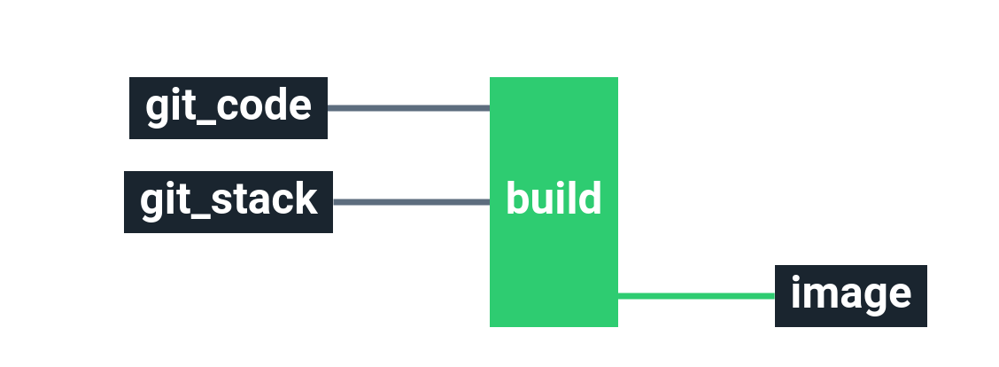

# Stack-dockerbuild

Service catalog Docker Build stack

Build and test a docker image before pushing it to a registry

# Requirements

In order to run this task, couple elements are required within the infrastructure:

  * Having a registry to store the builded Docker image

# Details

## Pipeline

**Jobs description**

  * `build`: Composed of several steps that you can provide : test, build, post build tests, upload the image.

Those steps can be configured for your own usage by putting the file from `docker/.ci/` into a `.ci` directory in your Docker image git repository `build.yml`, `post-tests.yml` and `tests.yml`.

**Variations**

There are 3 versions of the pipeline supported in this stack:
  * build and push: `pipeline.yml` + `variables.sample.yml` (default)
  * Github PRs: `pipeline-github-pr.yml` + `variables-github-pr.sample.yml`
  * Build + Deploy to K8s: `pipeline-build-deploy-k8s.yml` + `variables-build-deploy-k8s.sample.yml`
  * Deploy to k8s: `pipeline-deploy-k8s.yml` + `variables-deploy-k8s.sample.yml`

Currently, Cycloid console doesn't support yet switching between different pipeline variations, you will have to manually copy+paste pipeline+variables from GIT inside the Cycloid console to use them.

**Params**

***default & split-jobs***

|Name|Description|Type|Default|Required|
|---|---|:---:|:---:|:---:|
|`aws_access_key`|AWS access key if pushing to AWS ECR, otherwise leave it as a empty string.|`string`|`((aws.access_key))`|`False`|
|`aws_region`|AWS region if pushing to AWS ECR, otherwise leave it as a empty string.|`string`|`eu-west-1`|`False`|
|`aws_secret_key`|AWS secret key if pushing to AWS ECR, otherwise leave it as a empty string.|`string`|`((aws.secret_key))`|`False`|
|`code_build_args`|Set build-time variables for the Docker build|`dict`|``|`False`|
|`code_build_context`|Path from the repository root to the files to build. The Dockerfile location is relative to this path.|`string`|`.`|`True`|
|`code_dockerfile_location`|Dockerfile location related to code_build_context|`string`|`Dockerfile`|`True`|
|`code_git_branch`|Branch of the code git repository.|`string`|`master`|`True`|
|`code_git_private_key`|SSH key pair to fetch the code git repository.|`string`|`((ssh_code.ssh_key))`|`True`|
|`code_git_repository`|Git repository url containing the code of the stack.|`string`|`git@github.com:...`|`True`|
|`customer`|Name of the Cycloid Organization, used as customer variable name.|`-`|`($ organization_canonical $)`|`True`|
|`env`|Name of the project's environment.|`-`|`($ environment $)`|`True`|
|`project`|Name of the project.|`-`|`($ project $)`|`True`|
|`registry_extra_tags`|Additional tags to put on the builded image. Separate each tag with a space.|`string`|`'tag1 tag2'`|`False`|
|`registry_image_name`|Name of the repository image. If using AWS ECR you only need the repository name, not the full URI e.g. `alpine` not `012345678910.dkr.ecr.us-east-1.amazonaws.com/alpine`.|`string`|`myuser/imagename`|`True`|
|`registry_password`|Password for regular image repository, otherwise leave it as a empty string.|`string`|`secret`|`False`|
|`registry_tag`|tag to put on the builded image (eg latest).|`string`|`($ environment $)`|`True`|
|`registry_tag_commit_id`|Add additionnal tag using short commit id|`bool`|`false`|`False`|
|`registry_tag_custom_script`|Add additional tags using a `.ci/tag_custom_script.sh` shell script.|`bool`|`false`|`False`|
|`registry_tag_describe_ref`|Add additional tag using git describe ref: `<latest annoted git tag>-<the number of commit since the tag>-g<short_ref>` (eg. `v1.6.2-1-g13dfd7b`).|`bool`|`false`|`False`|
|`registry_username`|Username for regular image repository, otherwise leave it as a empty string.|`string`|`myuser`|`False`|
|`stack_git_branch`|Branch to use on the public stack git repository|`-`|`master`|`True`|

***github-pr***

|Name|Description|Type|Default|Required|
|---|---|:---:|:---:|:---:|
|`code_build_args`|Set build-time variables for the Docker build|`dict`|``|`False`|
|`code_build_context`|Path from the repository root to the files to build. The Dockerfile location is relative to this path.|`-`|`.`|`True`|
|`code_dockerfile_location`|Dockerfile location related to code_build_context|`-`|`Dockerfile`|`True`|
|`code_git_repository`|Git repository url containing the code of the stack.|`-`|`git@github.com:...`|`True`|
|`code_github_access_token`|Github access token for Github PRs|`-`|`((custom_github.access_token))`|`True`|
|`customer`|Name of the Cycloid Organization, used as customer variable name.|`-`|`($ organization_canonical $)`|`True`|
|`env`|Name of the project's environment.|`-`|`($ environment $)`|`True`|
|`project`|Name of the project.|`-`|`($ project $)`|`True`|
|`registry_extra_tags`|Additional tags to put on the builded image.|`-`|``|`False`|
|`registry_image_name`|Name of the repository image.|`-`|`myuser/imagename`|`True`|
|`registry_tag`|tag to put on the builded image (eg latest).|`-`|`($ environment $)`|`True`|
|`registry_tag_commit_id`|Add additionnal tag using short commit id|`bool`|`false`|`False`|
|`stack_git_branch`|Branch to use on the public stack git repository|`-`|`master`|`True`|

***deploy-k8s***

|Name|Description|Type|Default|Required|
|---|---|:---:|:---:|:---:|
|`aws_access_key`|AWS access key if pushing to AWS ECR, otherwise leave it as a empty string.|`string`|`((aws.access_key))`|`False`|
|`aws_region`|AWS region if pushing to AWS ECR, otherwise leave it as a empty string.|`string`|`eu-west-1`|`False`|
|`aws_secret_key`|AWS secret key if pushing to AWS ECR, otherwise leave it as a empty string.|`string`|`((aws.secret_key))`|`False`|
|`code_build_args`|Set build-time variables for the Docker build|`dict`|``|`False`|
|`code_build_context`|Path from the repository root to the files to build. The Dockerfile location is relative to this path.|`string`|`.`|`True`|
|`code_dockerfile_location`|Dockerfile location related to code_build_context|`string`|`Dockerfile`|`True`|
|`code_git_branch`|Branch of the code git repository.|`string`|`master`|`True`|
|`code_git_private_key`|SSH key pair to fetch the code git repository.|`string`|`((ssh_code.ssh_key))`|`True`|
|`code_git_repository`|Git repository url containing the code of the stack.|`string`|`git@github.com:...`|`True`|
|`config_git_branch`|Branch of the config Git repository.|`-`|`master`|`True`|
|`config_git_private_key`|SSH key pair to fetch the config Git repository.|`-`|`((ssh_config.ssh_key))`|`True`|
|`config_git_repository`|Git repository URL containing the K8s config of the stack.|`-`|`git@github.com:MyUser/config-dockerbuild.git`|`True`|
|`customer`|Name of the Cycloid Organization, used as customer variable name.|`-`|`($ organization_canonical $)`|`True`|
|`env`|Name of the project's environment.|`-`|`($ environment $)`|`True`|
|`k8s_base_path`|Path to the directory containing the base kustomization.yaml file to watch in the config git repository. Relative to k8s_path.|`-`|`base`|`True`|
|`k8s_continuous_deployment`|If the K8s deployment should be trigger automaticaly after the build or not.|`-`|`true`|`True`|
|`k8s_env_path`|Path to the overlay directory containing the env-specific kustomization.yaml file to watch in the config git repository. Relative to k8s_path.|`-`|`overlays/($ environment $)`|`True`|
|`k8s_kubeconfig`|Kubernetes config used to connect to the cluster.|`-`|`((custom_kubeconfig))`|`True`|
|`k8s_namespace`|Kubernetes namespace to use for the deployment.|`-`|`($ environment $)`|`True`|
|`k8s_path`|Path to the manifest(s) to apply in the config git repository, can be either a folder or a single file.|`-`|`($ project $)/k8s`|`True`|
|`k8s_version`|Kubernetes version for the kubernetes concourse resource.|`-`|`'1.16'`|`True`|
|`k8s_wait_ready_seconds`|How many seconds should the concourse kubernetes resource wait for the label selector.|`-`|`60`|`True`|
|`k8s_wait_ready_selector`|Used to tell the concourse kubernetes resource to wait for a certain label selector to be ready.|`-`|`''`|`True`|
|`project`|Name of the project.|`-`|`($ project $)`|`True`|
|`registry_extra_tags`|Additional tags to put on the builded image. Separate each tag with a space.|`string`|`'tag1 tag2'`|`False`|
|`registry_image_name`|Name of the repository image. If using AWS ECR you only need the repository name, not the full URI e.g. `alpine` not `012345678910.dkr.ecr.us-east-1.amazonaws.com/alpine`.|`string`|`myuser/imagename`|`True`|
|`registry_password`|Password for regular image repository, otherwise leave it as a empty string.|`string`|`secret`|`False`|
|`registry_tag`|tag to put on the builded image (eg latest).|`string`|`($ environment $)`|`True`|
|`registry_tag_commit_id`|Add additionnal tag using short commit id|`bool`|`false`|`False`|
|`registry_tag_custom_script`|Add additional tags using a `.ci/tag_custom_script.sh` shell script.|`bool`|`false`|`False`|
|`registry_tag_described_ref`|Add additional tag using git describe ref: `<latest annoted git tag>-<the number of commit since the tag>-g<short_ref>` (eg. `v1.6.2-1-g13dfd7b`).|`bool`|`false`|`False`|
|`registry_username`|Username for regular image repository, otherwise leave it as a empty string.|`string`|`myuser`|`False`|
|`stack_git_branch`|Branch to use on the public stack git repository|`-`|`master`|`True`|
