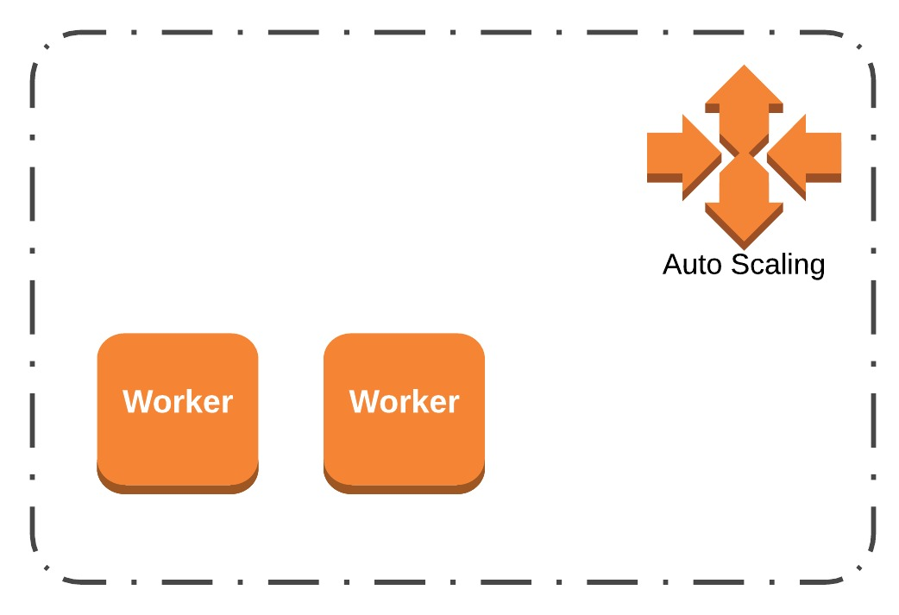
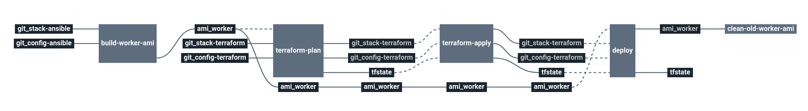

# stack-external-worker

Deploy external workers pool for Cycloid.io

Create an Amazon Auto Scaling Group with Cycloid workers installed in EC2 servers.

The worker EC2 server will also contain Fluentd agent to send logs to Amazon CloudWatch logs.
And also expose metrics in Prometheus format using Telegraf on port `9100`.

> note : The version of Cycloid workers is automatically generated by a `curl` on `scheduler_api_address`/api/v1/info URL.

# Architecture

<p align="center">

</p>

  * **ASG**: Amazon Auto Scaling Group

# Requirements

In order to run this task, couple elements are required within the infrastructure:

  * Having a VPC with private & public subnets [here](https://docs.aws.amazon.com/vpc/latest/userguide/getting-started-ipv4.html#getting-started-create-vpc)
  * Having an S3 bucket (with versioning) to store Terraform remote states [here](https://docs.aws.amazon.com/quickstarts/latest/s3backup/step-1-create-bucket.html)

# Details

## Pipeline

> **Note** The pipeline contains a manual approval between `terraform plan` and `terraform apply`.
> That means if you trigger a `terraform plan`, to apply it, you have to go on `terraform apply` job
> and click on the `+` button to trigger it.



**Jobs description**

  * `build-worker-ami` : Build Cycloid worker Amazon image AMI using Packer and Ansible.
  * `terraform-plan`: Terraform job that will simply make a plan of the external worker's stack.
  * `terraform-apply`: Terraform job similar to the plan one, but will actually create/update everything that needs to. Please see the plan diff for a better understanding.
  * `deploy` : Deploy the new AMI created into the ASG.
  * `clean-old-worker-ami` : Remove old AMI of Cycloid workers.
  * `terraform-destroy`: :warning: Terraform job meant to destroy the whole stack - **NO CONFIRMATION ASKED**. If triggered, the full project **WILL** be destroyed. Use with caution.

**Params**

|Name|Description|Type|Default|Required|
|---|---|:---:|:---:|:---:|
|`aws_access_key`|Amazon AWS access key for Terraform. See value format [Here](https://docs.cycloid.io/advanced-guide/integrate-and-use-cycloid-credentials-manager.html#vault-in-the-pipeline)|`-`|`((aws.access_key))`|`True`|
|`aws_default_region`|Amazon AWS region to use for Terraform.|`-`|`eu-west-1`|`True`|
|`aws_secret_key`|Amazon AWS secret key for Terraform. See value format [Here](https://docs.cycloid.io/advanced-guide/integrate-and-use-cycloid-credentials-manager.html#vault-in-the-pipeline)|`-`|`((aws.secret_key))`|`True`|
|`config_ansible_path`|Path of Ansible files in the config git repository|`-`|`($ project $)/ansible`|`True`|
|`config_git_branch`|Branch of the config git repository.|`-`|`master`|`True`|
|`config_git_private_key`|SSH key pair to fetch the config git repository.|`-`|`((ssh_config.ssh_key))`|`True`|
|`config_git_repository`|Git repository URL containing the config of the stack.|`-`|`git@github.com:MyUser/config-external-workers.git`|`True`|
|`config_terraform_path`|Path of Terraform files in the config git repository|`-`|`($ project $)/terraform/($ environment $)`|`True`|
|`customer`|Name of the Cycloid Organization, used as customer variable name.|`-`|`($ organization_canonical $)`|`True`|
|`debug_public_key`|Public ssh key injected by Packer during the build of the AMI for debug purpose|`-`|`"ssh-rsa ..."`|`False`|
|`env`|Name of the project's environment.|`-`|`($ environment $)`|`True`|
|`external_worker_key`|Name of the Cycloid credential containing a public and a private SSH key to configure Cycloid workers.|`cycloid_creds_name`|`cycloid-worker-keys`|`True`|
|`packer_ansible_version`|Version of ansible used during Packer build to run Ansible playbook|`-`|`"2.7"`|`False`|
|`project`|Name of the project.|`-`|`($ project $)`|`True`|
|`scheduler_api_address`|URL of the Pipeline scheduler API|`-`|`https://myscheduler.com`|`True`|
|`scheduler_host`|Host or IP of the Pipeline scheduler|`-`|`"myscheduler.com"`|`True`|
|`scheduler_port`|Port of the Pipeline scheduler|`-`|`2222`|`True`|
|`stack_git_branch`|Branch to use on the public stack git repository|`-`|`master`|`True`|
|`terraform_storage_bucket_name`|AWS S3 bucket name to store terraform remote state file.|`-`|`($ organization_canonical $)-terraform-remote-state`|`True`|

## Terraform

**Inputs**

|Name|Description|Type|Default|Required|
|---|---|:---:|:---:|:---:|
|`bastion_sg_allow`|Amazon source security group ID which will be allowed to connect on Magento front port 22 (ssh)|`-`|``|`False`|
|`keypair_name`|SSH keypair name to use to deploy ec2 instances|`-`|`cycloid-external-worker`|`False`|
|`extra_tags`|Dict of extra tags to add on aws resources. format { "foo" = "bar" }.|`-`|`{}`|`False`|
|`metrics_sg_allow`|Additionnal security group ID to assign to Cycloid workers. Goal is to allow monitoring server to query metrics|`-`|`""`|`False`|
|`public_subnets_ids`|Amazon public subnets IDs on which create each components.|`array`|``|`True`|
|`vpc_id`|Amazon VPC id on which create each components.|`-`|``|`True`|
|`worker_ami_id`|If you don't want to use the builded ami but a specific ami (mainly used for debug).|`string`|`""`|`False`|
|`worker_asg_max_size`|Amazon Auto Scaling Group max size configuration.|`-`|`6`|`False`|
|`worker_asg_min_size`|Amazon Auto Scaling Group min size configuration.|`-`|`1`|`False`|
|`worker_count`|Number of Aws EC2 worker server to create.|`-`|``|`True`|
|`worker_disk_size`|Root disk size in Go of Aws EC2 worker servers.|`-`|`20`|`False`|
|`worker_ebs_optimized`|Whether the Instance is EBS optimized or not, related to the instance type you choose.|`bool`|`true`|`False`|
|`worker_launch_template_profile`|Select launch template profile to use. Profile available "spot|ondemand"|`-`|`spot`|`False`|
|`worker_spot_price`|The maximum hourly price you're willing to pay for the Spot Instances. Linked to instance type.|`-`|`0.3`|`False`|
|`worker_type`|Type of AWS EC2 worker servers. This will be used for `spot` and `ondemand` launch config templates.|`-`|`c5d.2xlarge`|`False`|
|`worker_volume_disk_size`|Volume disk size in Go of Aws EC2 worker servers.|`-`|`130`|`False`|

**Outputs**

| Name | Description |
|------|-------------|
| asg_workers_sec_group_id | Security group ID of workers |

## Ansible

|Name|Description|Type|Default|Required|
|---|---|:---:|:---:|:---:|
|`concourse_worker_tag`|A tag to set during registration to create dedicated workers for some specific jobs. Eg FastStorage, ...|`-`|``|`False`|
|`concourse_worker_team`|The name of the team that this worker will be assigned to. Team ID is linked to your Cycloid organization.|`-`|``|`False`|
|`fs_volume_type`|Filesystem used to store concourse datas. Possible values "btrfs|ext4"|`-`|`btrfs`|`False`|
|`use_local_device`|Use local storage drive from the instance. Default use EBS volume /dev/xvdg or /dev/local0. If not found keep the var_lib_device|`-`|`false`|`False`|
|`var_lib_device`|Volume device name to use for worker datas. If "nodevice" and use_local_device=false no dedicated volume will be used.|`-`|`"nodevice"`|`False`|

# Deploy an external worker using Aws CloudFormation stack

Deploy using CloudFormation can be done with this url :

```
https://eu-central-1.console.aws.amazon.com/cloudformation/home?region=eu-west-1#/stacks/create/review
?templateURL=https://s3-eu-west-1.amazonaws.com/cycloid-cloudformation/external-worker-aws-cf-template.yaml
&stackName=cycloid-ci-workers
&param_TeamId=...
```


# Troubleshooting

## Test ansible role with molecule

Requires a bucket which contains a build of magento sources and AWS accesskey

virtualenv if needed
```
virtualenv    .env  --clear
source .env/bin/activate

pip install ansible==2.7
pip install molecule
pip install docker-py
```

Run the test
```
cd ansible

# Run molecule
molecule destroy
molecule converge
molecule verify
```

## don't stop a failling worker

If the user-data script fail on boot, the worker is destroyed after 3 min.
In case of debug, you can avoid termination of worker by creating a `/var/tmp/keeprunning` file.

```
ssh worker
touch /var/tmp/keeprunning
```
