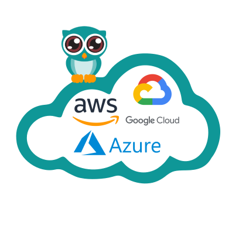

# Stack-getting-started

Getting started stack purpose is to ovver a easy to use Cycloid stack during onboarding process.

This stack offer on multi cloud provider to create a default compute instance.

# Requirements

In order to run this task, couple elements are required within the infrastructure depending of the cloud provider you choose:

  * **AWS**
    * An S3 bucket to store Terraform remote states [Here](https://docs.aws.amazon.com/quickstarts/latest/s3backup/step-1-create-bucket.html)
    * An access key to upload to this bucket and create ec2 instances [Here](https://docs.aws.amazon.com/IAM/latest/UserGuide/id_credentials_access-keys.html) 
  * **Azure**
    * A resource group [Here](https://docs.microsoft.com/en-us/azure/azure-resource-manager/management/manage-resource-groups-portal)
    * A data storage container to store Terraform remote states [Here](https://docs.microsoft.com/en-us/azure/storage/blobs/storage-quickstart-blobs-portal)
    * The subnet ID of a virtual network [Here](https://docs.microsoft.com/en-us/azure/virtual-network/quick-create-portal)
    * An Azure storage access key [Here](https://docs.microsoft.com/en-us/azure/storage/common/storage-account-keys-manage?tabs=azure-portal)
    * An Azure Managed Identity [Here](https://registry.terraform.io/providers/hashicorp/azurerm/latest/docs/guides/managed_service_identity)
  * **GCP** 
    * A storage buckets to store Terraform remote states [Here](https://cloud.google.com/storage/docs/creating-buckets)
    * A service account upload to this bucket and create a compute instances [Here](https://cloud.google.com/iam/docs/creating-managing-service-accounts)

