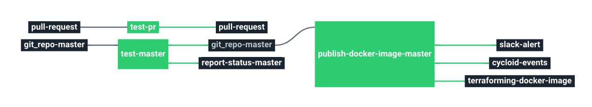

# Stack-golang

Service catalog for Golang stack.

This stack will create a pipeline to test golang projects.

# Requirements

No requirements

# Details

## Pipeline

**Jobs description**

  * `test-pr`: Pipeline task that will run tests on every pull request.
  * `test-master`: Pipeline job similar to the test-pr one, but it will run the test in the defined branch. It is usually the production branch.
  * `publish-docker-image-master`: Pipeline job that builds and publishes the docker image to docker hub.

**Params**

|Name|Description|Type|Default|Required|
|---|---|:---:|:---:|:---:|
|`git_repository`|Git repository URL containing the config of the stack.|`-`|`git@github.com:MyUser/MyRepo.git`|`True`|
|`git_repository_name`|Git repository name.|`-`|`MyUser/MyRepo`|`True`|
|`git_access_token`|Github token to fetch repo source code.|`-`|`((github_access_token.data))`|`True`|
|`git_private_key`|SSH key pair to fetch repor source code.|`-`|`((ssh_github.ssh_key))`|`True`|
|`docker_hub_repository`|Docker Hub repository name.|`-`|`MyUser/MyRepo`|`True`|
|`docker_hub_username`|Docker Hub username.|`-`|`((docker_hub.username))`|`True`|
|`docker_hub_password`|Docker Hub password.|`-`|`((docker_hub.password))`|`True`|
|`slack_webhook_url`|Webhook post url.|`-`|`((slack_webhook.url))`|`True`|
|`slack_author_link`|Webhook author link.|`-`|`https://example.com/`|`True`|
|`slack_author_name`|Webhook author name.|`-`|`example`|`True`|
|`cycloid_bot_account_login`|Cycloid bot account login.|`-`|`((cycloid_bot_account.login))`|`True`|
|`cycloid_bot_account_password`|Cycloid bot account password.|`-`|`((cycloid_bot_account.password))`|`True`|
|`env`|Name of the project's environment.|`-`|`($ environment $)`|`True`|
|`project`|Name of the project.|`-`|`($ project $)`|`True`|
|`customer`|Name of the Cycloid Organization, used as customer variable name.|`-`|`($ organization_canonical $)`|`True`|
|`docker_image`|Docker golang image name.|`-`|`golang`|`True`|
|`docker_image_tag`|Docker golang image version/tag.|`-`|`1.12`|`True`|
|`ci_context`|A context to use for the status. (Prefixed with cycloid-ci, defaults to cycloid-ci/status).|`-`|`golang-test`|`False`|
|`branch`|Default branch to use.|`-`|`master`|`True`|
|`go_path_cache`|Go dependencies cache path.|`-`|`go/pkg/mod`|`True`|
|`script`| Command to run the tests.|`-`|`go test ./...`|`True`|
