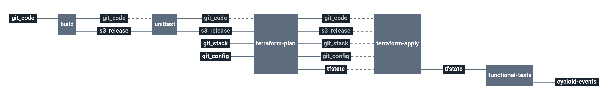

# AWS: Stack Hello world

Service catalog hello world stack

This stack will create a small pipeline and infrastructure on your AWS Cloud provider.

# Architecture

**AWS**
  * **Lambda**: Amazon Lambda

# Requirements

In order to run this task, couple elements are required within the infrastructure:

  * Having an S3 bucket to store Terraform remote states [Here](https://docs.aws.amazon.com/quickstarts/latest/s3backup/step-1-create-bucket.html)
  * Having an S3 bucket to the builded source code to deploy [Here](https://docs.aws.amazon.com/quickstarts/latest/s3backup/step-1-create-bucket.html)

# Details

## Pipeline

> **Note** The pipeline contains a manual approval between terraform plan and terraform apply.
> That means if you trigger a terraform plan, to apply it, you have to go on terraform apply job
> and click on the `+` button to trigger it.

**Jobs description**

  * `terraform-plan`: Terraform job that will simply make a plan of the stack.
  * `terraform-apply`: Terraform job similar to the plan one, but will actually create/update everything that needs to. Please see the plan diff for a better understanding.
  * `terraform-destroy`: :warning: Terraform job meant to destroy the whole stack - **NO CONFIRMATION ASKED**. If triggered, the full project **WILL** be destroyed. Use with caution.
  * `build` : Build the code source of the application
  * `unittest` : Run some dummy unittests
  * `functional-tests` : Run functional tests against the deployed application

**Params AWS**

|Name|Description|Type|Default|Required|
|---|---|:---:|:---:|:---:|
|`aws_access_key`|Amazon AWS access key for Terraform. See value format [here](https://docs.cycloid.io/advanced-guide/integrate-and-use-cycloid-credentials-manager.html#vault-in-the-pipeline)|`-`|`((aws.access_key))`|`True`|
|`aws_default_region`|Amazon AWS region to use for Terraform.|`-`|`eu-west-1`|`True`|
|`aws_secret_key`|Amazon AWS secret key for Terraform. See value format [here](https://docs.cycloid.io/advanced-guide/integrate-and-use-cycloid-credentials-manager.html#vault-in-the-pipeline)|`-`|`((aws.secret_key))`|`True`|
|`config_git_branch`|Branch of the config Git repository.|`-`|`master`|`True`|
|`config_git_private_key`|SSH key pair to fetch the config Git repository.|`-`|`((ssh_config.ssh_key))`|`True`|
|`config_git_repository`|Git repository URL containing the config of the stack.|`-`|`git@github.com:MyUser/config-git.git`|`True`|
|`customer`|Name of the Cycloid Organization, used as customer variable name.|`-`|`($ organization_canonical $)`|`True`|
|`env`|Name of the project's environment.|`-`|`($ environment $)`|`True`|
|`project`|Name of the project.|`-`|`($ project $)`|`True`|
|`release_bucket_object_path`|AWS S3 bucket path to store release of the code. This will be in the same bucket as the tfstate Terraform file.|`-`|`($ project $)/($ environment $)`|`True`|
|`terraform_storage_bucket_name`|AWS S3 bucket name to store terraform remote state file.|`-`|`($ organization_canonical $)-terraform-remote-state`|`True`|
|`terraform_storage_bucket_path`|AWS S3 bucket path to store terraform remote state file.|`-`|`($ project $)/($ environment $)`|`True`|

## Terraform AWS

**Inputs**

|Name|Description|Type|Default|Required|
|---|---|:---:|:---:|:---:|

**Outputs**

| Name | Description |
|------|-------------|
