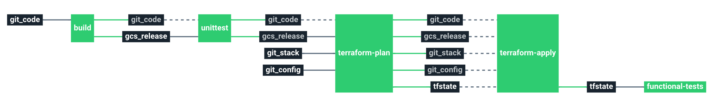

# GCP: Stack Hello world

Service catalog hello world stack

This stack will create a small pipeline and infrastructure on your GCP Cloud provider.

# Architecture

**GCP**
  * **Cloud function** Google Cloud Function

# Requirements

In order to run this task, some elements are required within the infrastructure:

  * Having a Google Cloud Platform account with a project:
    * [Create account](https://console.cloud.google.com/freetrial).
    * [Create project](https://cloud.google.com/resource-manager/docs/creating-managing-projects).
  * Having a cloud storage bucket (with versioning) to store Terraform remote states and the builded source code to deploy:
    * [Create a cloud storage bucket](https://cloud.google.com/storage/docs/creating-buckets).
    * [Versioning a cloud storage bucket](https://cloud.google.com/storage/docs/gsutil/commands/versioning)
  * Enable the cloud function api for your GCP project:
    * [Enable API](https://console.cloud.google.com/flows/enableapi?apiid=cloudfunctions&redirect=https://cloud.google.com/functions/quickstart).

# Details

## Pipeline

> **Note** The pipeline contains a manual approval between terraform plan and terraform apply.
> That means if you trigger a terraform plan, to apply it, you have to go on terraform apply job
> and click on the `+` button to trigger it.

**Jobs description**

  * `terraform-plan`: Terraform job that will simply make a plan of the stack.
  * `terraform-apply`: Terraform job similar to the plan one, but will actually create/update everything that needs to. Please see the plan diff for a better understanding.
  * `terraform-destroy`: :warning: Terraform job meant to destroy the whole stack - **NO CONFIRMATION ASKED**. If triggered, the full project **WILL** be destroyed. Use with caution.
  * `build` : Build the code source of the application
  * `unittest` : Run some dummy unittests
  * `functional-tests` : Run functional tests against the deployed application

**Params GCP**

|Name|Description|Type|Default|Required|
|---|---|:---:|:---:|:---:|
|`gcp_credentials`|GCP json credentials for Terraform. See value format [here](https://docs.cycloid.io/advanced-guide/integrate-and-use-cycloid-credentials-manager.html#vault-in-the-pipeline).|`-`|`((gcp_credentials.json))`|`True`|
|`gcp_project`|GCP project to use for Terraform.|`-`|`hello-world`|`True`|
|`gcp_default_region`|GCP region to use for Terraform.|`-`|`europe-west1`|`True`|
|`terraform_storage_bucket_name`|GCP GCS bucket name to store terraform remote state file.|`-`|`($ organization_canonical $)-terraform-remote-state`|`True`|
|`config_git_repository`|Git repository URL containing the config of the stack.|`-`|`git@github.com:MyUser/config-git.git`|`True`|
|`config_git_branch`|Branch of the config Git repository.|`-`|`master`|`True`|
|`config_git_private_key`|SSH key pair to fetch the config Git repository.|`-`|`((git_config.ssh_key))`|`True`|
|`env`|Name of the project's environment.|`-`|`($ environment $)`|`True`|
|`project`|Name of the project.|`-`|`($ project $)`|`True`|
|`customer`|Name of the Cycloid Organization, used as customer variable name.|`-`|`($ organization_canonical $)`|`True`|
|`release_bucket_object_path`|GCP GCS bucket path to store release of the code. This will be in the same bucket as the tfstate Terraform file.|`-`|`($ project $)/($ environment $)/($ project $).zip`|`True`|
|`terraform_storage_bucket_path`|GCP GCS bucket path to store terraform remote state file.|`-`|`($ project $)/($ environment $)`|`True`|

## Terraform GCP

**Inputs**

|Name|Description|Type|Default|Required|
|---|---|:---:|:---:|:---:|

**Outputs**

| Name | Description |
|------|-------------|
