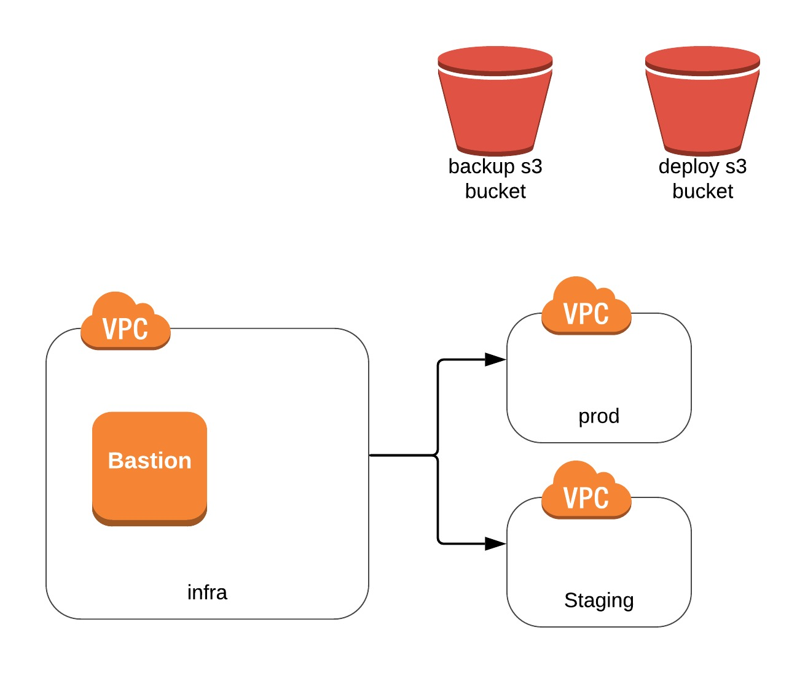
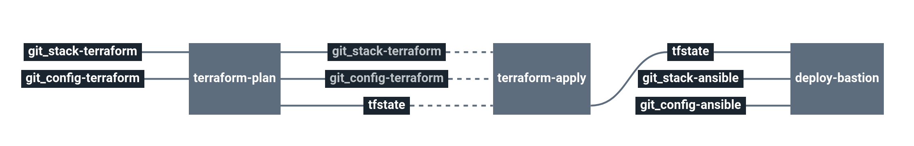

# Stack-infrastructure

Service catalog infrastructure stack

This stack will create Amazon vpc, a bastion ec2 server and various components you might require to deploy other stacks in production.

# Architecture

  * **EC2** Amazon Elastic Compute Cloud
  * **S3** Amazon Simple Storage Service
  * **VPC** Amazon Virtual Private Cloud
    * containing subnets, key pair, security groups, ...
  * **SES** Amazon Simple Email Service
  * **IAM** Amazon Identity and Access Management

# Requirements

In order to run this task, couple elements are required within the infrastructure:

  * Having an S3 bucket to store Terraform remote states [Here](https://docs.aws.amazon.com/quickstarts/latest/s3backup/step-1-create-bucket.html)

# Details

## Pipeline

> **Note** The pipeline contains a manual approval between terraform plan and terraform apply.
> That means if you trigger a terraform plan, to apply it, you have to go on terraform apply job
> and click on the `+` button to trigger it.

**Jobs description**

  * `terraform-plan`: Terraform job that will simply make a plan of the infrastructure's stack.
  * `terraform-apply`: Terraform job similar to the plan one, but will actually create/update everything that needs to. Please see the plan diff for a better understanding.
  * `terraform-destroy`: :warning: Terraform job meant to destroy the whole stack - **NO CONFIRMATION ASKED**. If triggered, the full project **WILL** be destroyed. Use with caution.
  * `deploy-bastion`: Ansible job meant to configure Amazon EC2 server used as bastion.

**Params**

|Name|Description|Type|Default|Required|
|---|---|:---:|:---:|:---:|
|`ansible_vault_password`|Password used by ansible vault to decrypt your vaulted files.|`-`|`((custom_ansible_vault_password))`|`True`|
|`aws_access_key`|Amazon AWS access key for Terraform. see value format [Here](https://docs.cycloid.io/advanced-guide/integrate-and-use-cycloid-credentials-manager.html#vault-in-the-pipeline)|`-`|`((aws.access_key))`|`True`|
|`aws_default_region`|Amazon AWS region to use for Terraform.|`-`|`eu-west-1`|`True`|
|`aws_secret_key`|Amazon AWS secret key for Terraform. see value format [Here](https://docs.cycloid.io/advanced-guide/integrate-and-use-cycloid-credentials-manager.html#vault-in-the-pipeline)|`-`|`((aws.secret_key))`|`True`|
|`bastion_keypair`|bastion SSH private key used by ansible to connect on aws ec2 instances and the bastion itself.|`-`|`((ssh_bastion.ssh_key))`|`True`|
|`config_git_branch`|Branch of the config git repository.|`-`|`config`|`True`|
|`config_git_private_key`|SSH key pair to fetch the config git repository.|`-`|`((ssh_config_ro.ssh_key))`|`True`|
|`config_git_repository`|Git repository url containing the config of the stack.|`-`|`ssh://myUserId@git-codecommit.eu-west-1.amazonaws.com/v1/repos/myRepo`|`True`|
|`customer`|Name of the Cycloid Organization, used as customer variable name.|`-`|`($ organization_canonical $)`|`True`|
|`env`|Name of the project's environment.|`-`|`($ environment $)`|`True`|
|`project`|Name of the project.|`-`|`($ project $)`|`True`|
|`stack_git_branch`|Git branch of the stack source code.|`-`|`master`|`True`|
|`stack_git_repository`|Url to the git repository containing infrastructure stack source code.|`-`|`https://github.com/cycloid-community-catalog/stack-infrastructure`|`True`|
|`terraform_storage_bucket_name`|AWS S3 bucket name to store terraform remote state file.|`-`|`($ organization_canonical $)-terraform-remote-state`|`True`|
|`terraform_storage_bucket_path`|AWS S3 bucket path to store terraform remote state file.|`-`|`($ project $)/($ environment $)`|`True`|

## Terraform

**Inputs**

|Name|Description|Type|Default|Required|
|---|---|:---:|:---:|:---:|
|`aws_region`|Name of the region where the infrastructure is created|`-`|`us-east-1`|`False`|
|`backup_bucket_prefix`|Prefix for the S3 backup bucket (change it if a bucket with the same name already exists) - defaults to '${var.customer}-'|`-`|`""`|`False`|
|`bastion_allowed_networks`|Networks allowed to connect to the bastion using SSH|`-`|`0.0.0.0/0`|`False`|
|`bastion_instance_type`|Instance type for the bastion|`-`|`t3.micro`|`False`|
|`create_infra_user`|admin user infra has to be created or not|`int`|`0`|`False`|
|`create_s3_bucket_remote_state`|terraform_remote_state s3 bucket has to be created or not|`int`|`0`|`False`|
|`enable_dynamodb_endpoint`|Should be true if you want to provision a DynamoDB endpoint to the VPC|`bool`|`false`|`False`|
|`enable_s3_endpoint`|Should be true if you want to provision an S3 endpoint to the VPC|`bool`|`false`|`False`|
|`extra_admin_users`|List of users to give the administrator access role to|`list`|`[]`|`False`|
|`infra_associate_vpc_to_all_private_zones`|Should be true if you want to associate the infra VPC to staging and prod privates zones.|`bool`|`false`|`False`|
|`infra_cidr`|The CIDR of the infra VPC|`-`|`10.0.0.0/16`|`False`|
|`infra_private_subnets`|The private subnets for the infra VPC|`list`|`["10.0.0.0/24", "10.0.2.0/24", "10.0.4.0/24"]`|`False`|
|`infra_public_subnets`|The public subnets for the infra VPC|`list`|`["10.0.1.0/24", "10.0.3.0/24", "10.0.5.0/24"]`|`False`|
|`keypair_name`|The human-readable keypair name to be used for instances deployment|`-`|`"${var.customer}-${var.project}${var.suffix}"`|`False`|
|`keypair_public`|The public SSH key, for SSH access to newly-created instances|`-`|``|`True`|
|`metrics_allowed_sg`|If you use the prometheus stack, you can define the provider and define the metrics_allowed_sg variable after creating promeheusFirst create infra, second create prometheus, third uncomment variable|`-`|``|`False`|
|`prod_cidr`|The CIDR of the prod VPC|`-`|`10.2.0.0/16`|`False`|
|`prod_elasticache_subnets`|The Elasticache subnets for the prod VPC|`list`|`[]`|`False`|
|`prod_private_subnets`|The private subnets for the prod VPC|`list`|`["10.2.0.0/24", "10.2.2.0/24", "10.2.4.0/24"]`|`False`|
|`prod_public_subnets`|The public subnets for the prod VPC|`list`|`["10.2.1.0/24", "10.2.3.0/24", "10.2.5.0/24"]`|`False`|
|`prod_rds_subnets`|The RDS subnets for the prod VPC|`list`|`["10.2.2.0/24", "10.2.6.0/24", "10.2.10.0/24"]`|`False`|
|`readonly_groups`||`list`|`[]`|`False`|
|`readonly_users`|List of users to give a read-only access to|`list`|`[]`|`False`|
|`staging_cidr`|The CIDR of the staging VPC|`-`|`10.1.0.0/16`|`False`|
|`staging_elasticache_subnets`|The Elasticache subnets for the staging VPC|`list`|`[]`|`False`|
|`staging_private_subnets`|The private subnets for the staging VPC|`list`|`["10.1.0.0/24", "10.1.2.0/24", "10.1.4.0/24"]`|`False`|
|`staging_public_subnets`|The public subnets for the staging VPC|`list`|`["10.1.1.0/24", "10.1.3.0/24", "10.1.5.0/24"]`|`False`|
|`staging_rds_subnets`|The RDS subnets for the staging VPC|`list`|`["10.1.2.0/24", "10.1.6.0/24", "10.1.10.0/24"]`|`False`|
|`zones`|The availability zones you want to use|`-`|`[]`|`False`|

**Outputs**

| Name | Description |
|------|-------------|
| bastion_ip | The EIP attached to the bastion EC2 server |
| deployment_bucket_name | S3 bucket name for the deployment bucket |
| iam_policy_infra-backup | IAM read and write policy to the S3 backup bucket |
| iam_policy_infra-logs | IAM write policy to AWS Cloudwatch logs |
| iam_policy_s3-deployment | IAM read and write policy to the S3 deployment bucket |
| iam_ses_smtp_user_key | The dedicated SES user |
| iam_ses_smtp_user_secret | The dedicated SES user secret |
| infra_bastion_sg_allow | The security group ID to allow SSH traffic from the bastion to the infra instances |
| infra_private_subnets | The private subnets for the infra VPC |
| infra_private_zone_id | The Route53 private zone ID for the infra VPC |
| infra_public_subnets | The public subnets for the infra VPC |
| infra_rds_parameters-mysql57 | The RDS parameter group ID for the infra VPC |
| infra_vpc_id | The VPC ID for the infra VPC |
| keypair_name | The deployment keypair name |
| prod_bastion_sg_allow | security group ID tp allow SSH traffic from the bastion to the prod instances |
| prod_elasticache_subnet_group | The elasticache subnet group for the prod VPC |
| prod_elasticache_subnets | The elasticache subnets for the prod VPC |
| prod_private_subnets | The private subnets for the prod VPC |
| prod_private_zone_id | Route53 private zone ID for the prod VPC |
| prod_public_subnets | The public subnets for the prod VPC |
| prod_rds_parameters-mysql57 | RDS db parameters ID for the prod VPC |
| prod_rds_subnet_group | The RDS subnet group for the prod VPC |
| prod_rds_subnets | The RDS subnets for the prod VPC |
| prod_redshift_subnet_group | The Redshift subnet group for the prod VPC |
| prod_redshift_subnets | The redshift subnets for the prod VPC |
| prod_vpc_id | The VPC ID for the prod VPC |
| staging_bastion_sg_allow | security group ID tp allow SSH traffic from the bastion to the staging instances |
| staging_elasticache_subnet_group | The elasticache subnet group for the staging VPC |
| staging_elasticache_subnets | The elasticache subnets for the staging VPC |
| staging_private_subnets | The private subnets for the staging VPC |
| staging_private_zone_id | Route53 private zone ID for the staging VPC |
| staging_public_subnets | The public subnets for the staging VPC |
| staging_rds_parameters-mysql57 | RDS db parameters ID for the staging VPC |
| staging_rds_subnet_group | The RDS subnet group for the staging VPC |
| staging_rds_subnets | The RDS subnets for the staging VPC |
| staging_redshift_subnet_group | The Redshift subnet group for the staging VPC |
| staging_redshift_subnets | The redshift subnets for the staging VPC |
| staging_vpc_id | The VPC ID for the staging VPC |
| zones | AWS availability zones used |

## Ansible

|Name|Description|Type|Default|Required|
|---|---|:---:|:---:|:---:|
|`backup_snapshots`|Setup cron to trigger EC2 snapshots.|`dict`|`{}`|`False`|
|`base_custom_hosts`|Define extra custom hosts for the /etc/hosts file to fill with|`dict`|`{}`|`False`|
|`base_deps`|When set to true it will try installing extra packagesd defined afterwards|`bool`|`true`|`False`|
|`base_extra_packages`|The extra packages (deb/rpm) to install|`list`|`[]`|`False`|
|`base_extra_pip_packages`|The extra pip packages to install|`list`|`[]`|`False`|
|`base_hosts`|If host settings should be included|`bool`|`true`|`False`|
|`base_hosts_suffix`|Specify if you want specific hosts suffix|`-`|`""`|`False`|
|`base_manage_host_file`|Set to true if you want the hosts file to be managed|`bool`|`true`|`False`|
|`base_manage_host_r53`|Set to true if you want internal entries to be created|`bool`|`false`|`False`|
|`base_r53_internal_zone`|Defines in which internal zone entries should be added in R53|`-`|`""`|`False`|
