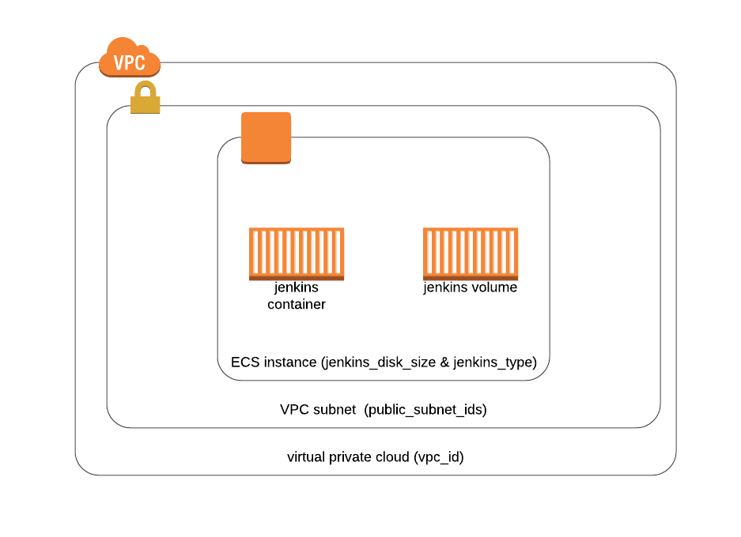
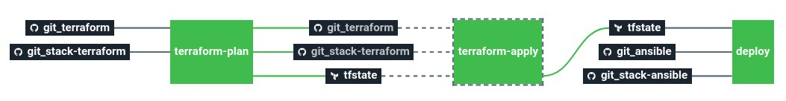

# Stack-jenkins

Service catalog Jenkins stack

This stack will deploy a Jenkins Docker container on a Amazon EC2 instance with an EBS storage.

# Architecture



# Requirements

In order to run this task, couple elements are required within the infrastructure:

  * Having a VPC with public subnets [here](https://docs.aws.amazon.com/vpc/latest/userguide/getting-started-ipv4.html#getting-started-create-vpc)
  * Having an S3 bucket with versioning to store Terraform remote states [here](https://docs.aws.amazon.com/quickstarts/latest/s3backup/step-1-create-bucket.html)
  * Having a bastion server to run Ansible like described [here](https://docs.cycloid.io/advanced-guide/ansible-integration.html#standard-usage)

# Details

## Pipeline

> **Note**: this pipeline contains a manual approval between terraform plan and terraform apply.
> That means if you trigger a terraform plan, to apply it, you have to go on terraform apply job
> and click on the `+` button to trigger it. Same goes for terraform destroy.



**Jobs description**

  * `terraform-plan`: Terraform job that will simply make a plan of the stack.
  * `terraform-apply`: Terraform job similar to the plan one, but will actually create/update everything that needs to. Please see the plan diff for a better understanding.
  * `deploy`: Ansible job to deploy the application on EC2 server.
  * `terraform-destroy`: :warning: Terraform job meant to destroy the whole stack - **NO CONFIRMATION ASKED**. If triggered, the full project **WILL** be destroyed. Use with caution.


**Params**

|Name|Description|Type|Default|Required|
|---|---|:---:|:---:|:---:|
|`ansible_version`|Ansible version used in packer and cycloid-toolkit ansible runner|`-`|`"2.7"`|`True`|
|`aws_access_key`|Amazon AWS access key for Terraform. See value format [here](https://docs.cycloid.io/advanced-guide/integrate-and-use-cycloid-credentials-manager.html#vault-in-the-pipeline)|`-`|`((aws.access_key))`|`True`|
|`aws_default_region`|Amazon AWS region to use for Terraform.|`-`|`eu-west-1`|`True`|
|`aws_secret_key`|Amazon AWS secret key for Terraform. See value format [here](https://docs.cycloid.io/advanced-guide/integrate-and-use-cycloid-credentials-manager.html#vault-in-the-pipeline)|`-`|`((aws.secret_key))`|`True`|
|`bastion_private_key_pair`|bastion SSH private key used by ansible to connect on AWS EC2 instances and the bastion itself.|`-`|`((ssh_bastion.ssh_key))`|`True`|
|`bastion_url`|bastion URL used by ansible to connect on AWS EC2 instances.|`-`|`user@bastion.server.com`|`True`|
|`git_ansible_path`|Path of Ansible files in the config Git repository|`-`|`($ project $)/ansible`|`True`|
|`git_branch`|Branch of the config Git repository.|`-`|`master`|`True`|
|`git_private_key`|SSH key pair to fetch the config Git repository.|`-`|`((ssh_config.ssh_key))`|`True`|
|`git_repository`|Git repository URL containing the config of the stack.|`-`|`git@github.com:MyUser/config-jenkins.git`|`True`|
|`git_terraform_path`|Path of Terraform files in the config Git repository|`-`|`($ project $)/terraform/($ environment $)`|`True`|
|`customer`|Name of the Cycloid Organization, used as customer variable name.|`-`|`($ organization_canonical $)`|`True`|
|`env`|Name of the project's environment.|`-`|`($ environment $)`|`True`|
|`extra_tags`|Dict of extra tags to add on aws resources. format { "foo" = "bar" }.|`-`|`{}`|`False`|
|`project`|Name of the project.|`-`|`($ project $)`|`True`|
|`terraform_storage_bucket_name`|AWS S3 bucket name to store terraform remote state file.|`-`|`($ organization_canonical $)-terraform-remote-state`|`True`|

## Terraform

**Inputs**

|Name|Description|Type|Default|Required|
|---|---|:---:|:---:|:---:|
|`bastion_sg_allow`|Amazon source security group ID which will be allowed to connect on Fronts port 22 (ssh).|`-`|``|`False`|
|`keypair_name`|SSH keypair name to use to deploy ec2 instances.|`-`|`cycloid`|`False`|
|`jenkins_disk_size`|Disk size for the Jenkins server.|`-`|`60`|`False`|
|`jenkins_type`|Amazon EC2 instance type for Jenkins server.|`-`|`t3.small`|`False`|
|`public_subnets_ids`|Amazon subnets IDs on which create each components.|`array`|``|`True`|
|`vpc_id`|Amazon VPC id on which create each components.|`-`|``|`True`|

## Ansible

|Name|Description|Type|Default|Required|
|---|---|:---:|:---:|:---:|
|`jenkins_port`|Jenkins port to listen on|`integer`|`80`|`False`|
|`jenkins_version`|Jenkins version to use. (docker version)|`string`|`2.60.3`|`False`|

# Molecule tests

To run the Ansible tests, you will need to fetch the sources:

```shell
$ git clone https://github.com/cycloid-community-catalog/stack-jenkins.git
$ cd stack-jenkins
```

Please be sure that your Docker daemon is up and running:

```shell
$ docker info
Client:
 Debug Mode: false

Server:
...
```

`python3` and `virtualenv` must be in the path:

```shell
$ python -V
Python 3.8.0
$ virtualenv --version
16.7.8
```

Go in the `ansible/` directory, create a `venv` and install the requirements:

```shell
$ cd ansible
$ virtualenv venv
$ source venv/bin/activate
$ pip install -r requirements.txt
```

You can now run the tests:

```shell
$ molecule test
```
