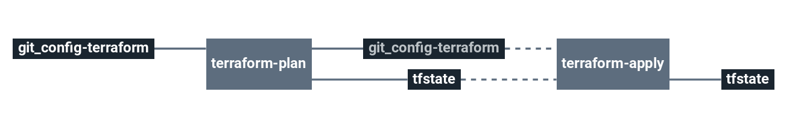

# stack-kapsule

This stack will create a Scaleway Kubernetes Kapsule cluster with one or more node pools.

# Architecture

  * **Kapsule**: Scaleway Kubernetes Kapsule
  * **Node Pool**: Scaleway Kubernetes Kapsule Node Pool

# Requirements

In order to run this task, couple elements are required within the infrastructure:

  * Having an Object Storage Bucket to store Terraform remote states [Here](https://www.scaleway.com/en/docs/block-storage-overview/)

# Details

## Pipeline

> **Note** The pipeline contains a manual approval between terraform plan and terraform apply.
> That means if you trigger a terraform plan, to apply it, you have to go on terraform apply job
> and click on the `+` button to trigger it.

**Jobs description**

  * `terraform-plan`: Terraform job that will simply make a plan of the stack.
  * `terraform-apply`: Terraform job similar to the plan one, but will actually create/update everything that needs to. Please see the plan diff for a better understanding.
  * `terraform-destroy`: :warning: Terraform job meant to destroy the whole stack - **NO CONFIRMATION ASKED**. If triggered, the full project **WILL** be destroyed. Use with caution.

**Params**

|Name|Description|Type|Default|Required|
|---|---|:---:|:---:|:---:|
|`config_git_branch`|Branch of the config Git repository.|`-`|`master`|`True`|
|`config_git_private_key`|SSH key pair to fetch the config Git repository.|`-`|`((ssh_config.ssh_key))`|`True`|
|`config_git_repository`|Git repository URL containing the config of the stack.|`-`|`git@github.com:MyUser/config-kapsule.git`|`True`|
|`config_terraform_path`|Path of Terraform files in the config git repository|`-`|`($ project $)/terraform/($ environment $)`|`True`|
|`customer`|Name of the Cycloid Organization, used as customer variable name.|`-`|`($ organization_canonical $)`|`True`|
|`env`|Name of the project's environment.|`-`|`($ environment $)`|`True`|
|`project`|Name of the project.|`-`|`($ project $)`|`True`|
|`scw_access_key`|Scaleway access key for Terraform. See [here](https://console.scaleway.com/account/organization/credentials).|`-`|`((scaleway.access_key))`|`True`|
|`scw_default_region`|Scaleway region to use for Terraform.|`-`|`fr-par`|`True`|
|`scw_organization_id`|Scaleway secret key for Terraform. See [here](https://console.scaleway.com/account/organization/credentials).|`-`|`((scaleway.organization_id))`|`True`|
|`scw_secret_key`|Scaleway organization ID for Terraform. See [here](https://console.scaleway.com/account/organization/credentials).|`-`|`((scaleway.secret_key))`|`True`|
|`stack_git_branch`|Branch to use on the public stack Git repository|`-`|`master`|`True`|
|`terraform_storage_bucket_name`|AWS S3 bucket name to store terraform remote state file.|`-`|`($ organization_canonical $)-terraform-remote-state`|`True`|
|`terraform_version`|terraform version used to execute your code.|`-`|`'0.13.3'`|`True`|

## Terraform

**Inputs**

|Name|Description|Type|Default|Required|
|---|---|:---:|:---:|:---:|
|`admission_plugins`|The list of admission plugins to enable on the cluster.|`-`|`[]`|`False`|
|`auto_upgrade`|Set to `true` to enable Kubernetes patch version auto upgrades. Important: When enabling auto upgrades, the `cluster_version` variable take a minor version like x.y (ie 1.18).|`-`|`true`|`False`|
|`cluster_version`|Kapsule cluster version.|`-`|`1.19`|`False`|
|`cni`|The Container Network Interface (CNI) for the Kubernetes cluster (either `cilium`, `calico`, `weave` or `flannel`).|`-`|`cilium`|`False`|
|`container_runtime`|The container runtime of the pool. Important: Updates to this field will recreate a new resource.|`-`|`docker`|`False`|
|`enable_autohealing`|Enables the autohealing feature for this pool.|`-`|`true`|`False`|
|`enable_autoscaling`|Enables the autoscaling feature for this pool. Important: When enabled, an update of the size will not be taken into account.|`-`|`false`|`False`|
|`enable_dashboard`|Enables the Kubernetes dashboard for the Kubernetes cluster.|`-`|`true`|`False`|
|`extra_tags`|Dict of extra tags to add on aws resources. format { "foo" = "bar" }.|`-`|`{}`|`False`|
|`feature_gates`|The list of feature gates to enable on the cluster.|`-`|`[]`|`False`|
|`ingress`|The ingress controller to be deployed on the Kubernetes cluster (either `nginx`, `traefik` or `traefik2`).|`-`|`nginx`|`False`|
|`node_autoscaling_max_size`|The maximum size of the pool, used by the autoscaling feature.|`-`|`10`|`False`|
|`node_autoscaling_min_size`|The minimum size of the pool, used by the autoscaling feature.|`-`|`1`|`False`|
|`node_count`|Desired number of node servers.|`-`|`1`|`False`|
|`node_pool_name`|Node group given name.|`-`|`standard`|`False`|
|`node_type`|Type of instance to use for node servers.|`-`|`GP1-XS`|`False`|
|`placement_group_id`|The placement group the nodes of the pool will be attached to. Important: Updates to this field will recreate a new resource.|`-`|`""`|`False`|
|`wait_for_pool_ready`|Whether to wait for the pool to be ready.|`-`|`true`|`False`|

**Outputs**

| Name | Description |
|------|-------------|
|`cluster_id`|Kapsule Cluster ID.|
|`cluster_name`|Kapsule Cluster name.|
|`cluster_status`|Kapsule Cluster status of the Kubernetes cluster.|
|`cluster_upgrade_available`|Set to `true` if a newer Kubernetes version is available.|
|`cluster_version`|Kapsule Cluster version.|
|`cluster_wildcard_dns`|The DNS wildcard that points to all ready nodes.|
|`control_plane_ca`|Kapsule Cluster CA certificate of the Kubernetes API server.|
|`control_plane_endpoint`|Kapsule Cluster URL of the Kubernetes API server.|
|`control_plane_host`|Kapsule Cluster URL of the Kubernetes API server.|
|`control_plane_token`|Kapsule Cluster token to connect to the Kubernetes API server.|
|`kubeconfig`|Kubernetes config to connect to the Kapsule cluster.|
|`node_pool_current_size`|Kapsule node pool current size.|
|`node_pool_id`|Kapsule node pool ID.|
|`node_pool_nodes`|Kapsule node pool nodes informations.|
|`node_pool_public_ips`|Kapsule node pool public IPs.|
|`node_pool_public_ipv6s`|Kapsule node pool public IPv6s.|
|`node_pool_status`|Kapsule node pool status.|
|`node_pool_version`|Kapsule node pool version.|
|`scw_region`|Scaleway region where the resources were created.|
|`scw_zone`|Scaleway zone where the resources were created.|

# Known Issues
