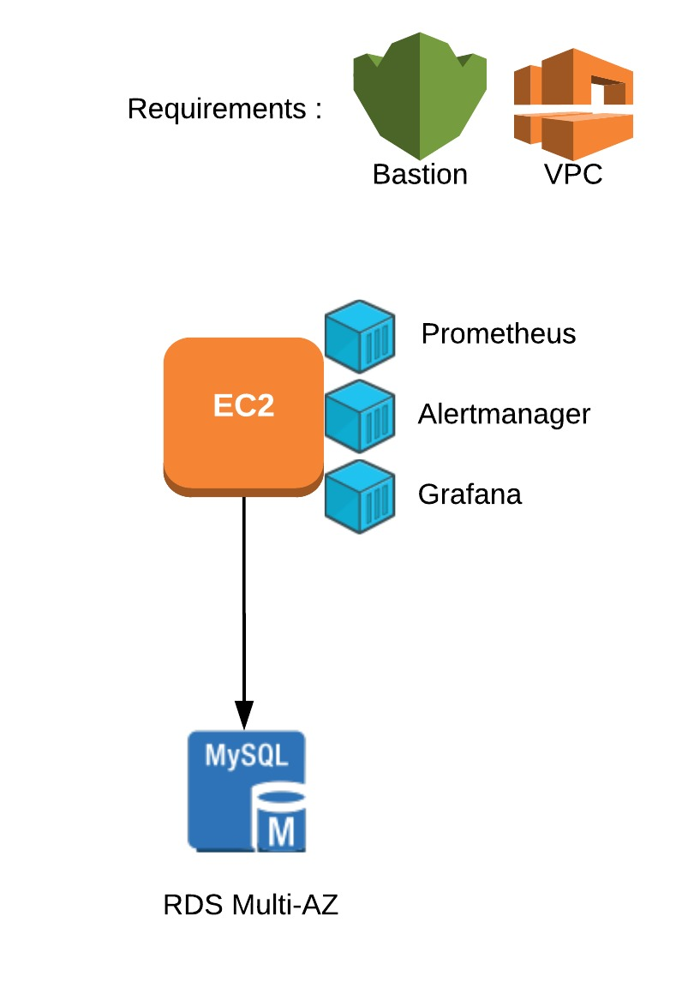
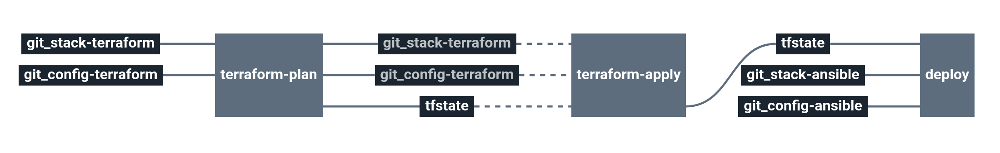

# Stack-prometheus

Service catalog Prometheus stack

This stack will deploy a Prometheus, Alertmanager and Grafana Docker container on a Amazon EC2 instance with an EBS storage.

# Architecture

<p align="center">

</p>


  * **EC2** Amazon Elastic Compute Cloud
  * **RDS** Amazon Relational Database Service

# Requirements

In order to run this task, couple elements are required within the infrastructure:

  * Having a VPC with private & public subnets [here](https://docs.aws.amazon.com/vpc/latest/userguide/getting-started-ipv4.html#getting-started-create-vpc)
  * Having an S3 bucket with versioning to store Terraform remote states [here](https://docs.aws.amazon.com/quickstarts/latest/s3backup/step-1-create-bucket.html)
  * Having a bastion server to run Ansible like described [here](https://docs.cycloid.io/advanced-guide/ansible-integration.html#standard-usage)

# Details

## Pipeline

> **Note** The pipeline contains a manual approval between terraform plan and terraform apply.
> That means if you trigger a terraform plan, to apply it, you have to go on terraform apply job
> and click on the `+` button to trigger it.



**Jobs description**

  * `terraform-plan`: Terraform job that will simply make a plan of the stack.
  * `terraform-apply`: Terraform job similar to the plan one, but will actually create/update everything that needs to. Please see the plan diff for a better understanding.
   * `deploy`: Ansible job to deploy the application on EC2 server. In this case Prometheus, Grafana, ...
  * `terraform-destroy`: :warning: Terraform job meant to destroy the whole stack - **NO CONFIRMATION ASKED**. If triggered, the full project **WILL** be destroyed. Use with caution.


**Params**

|Name|Description|Type|Default|Required|
|---|---|:---:|:---:|:---:|
|`ansible_vault_password`|Password used by ansible vault to decrypt your vaulted files.|`-`|`((custom_ansible_vault_password))`|`True`|
|`ansible_version`|Ansible version used in packer and cycloid-toolkit ansible runner|`-`|`"2.9"`|`True`|
|`aws_access_key`|Amazon AWS access key for Terraform. See value format [here](https://docs.cycloid.io/advanced-guide/integrate-and-use-cycloid-credentials-manager.html#vault-in-the-pipeline)|`-`|`((aws.access_key))`|`True`|
|`aws_default_region`|Amazon AWS region to use for Terraform.|`-`|`eu-west-1`|`True`|
|`aws_secret_key`|Amazon AWS secret key for Terraform. See value format [here](https://docs.cycloid.io/advanced-guide/integrate-and-use-cycloid-credentials-manager.html#vault-in-the-pipeline)|`-`|`((aws.secret_key))`|`True`|
|`bastion_private_key_pair`|bastion SSH private key used by ansible to connect on AWS EC2 instances and the bastion itself.|`-`|`((ssh_bastion.ssh_key))`|`True`|
|`bastion_url`|bastion URL used by ansible to connect on AWS EC2 instances.|`-`|`user@bastion.server.com`|`True`|
|`config_ansible_path`|Path of Ansible files in the config Git repository|`-`|`($ project $)/ansible`|`True`|
|`config_git_branch`|Branch of the config Git repository.|`-`|`master`|`True`|
|`config_git_private_key`|SSH key pair to fetch the config Git repository.|`-`|`((ssh_config.ssh_key))`|`True`|
|`config_git_repository`|Git repository URL containing the config of the stack.|`-`|`git@github.com:MyUser/config-prometheus.git`|`True`|
|`config_terraform_path`|Path of Terraform files in the config Git repository|`-`|`($ project $)/terraform/($ environment $)`|`True`|
|`customer`|Name of the Cycloid Organization, used as customer variable name.|`-`|`($ organization_canonical $)`|`True`|
|`env`|Name of the project's environment.|`-`|`($ environment $)`|`True`|
|`extra_tags`|Dict of extra tags to add on aws resources. format { "foo" = "bar" }.|`-`|`{}`|`False`|
|`grafana_admin_password`|Define Grafana admin account password|`-`|`"((custom_grafana_admin_password))"`|`False`|
|`project`|Name of the project.|`-`|`($ project $)`|`True`|
|`rds_password`|Password used for your rds (grafana) if needed|`-`|`((custom_rds_password))`|`False`|
|`stack_git_branch`|Branch to use on the public stack git repository|`-`|`master`|`True`|
|`terraform_storage_bucket_name`|AWS S3 bucket name to store terraform remote state file.|`-`|`($ organization_canonical $)-terraform-remote-state`|`True`|

## Terraform

**Inputs**

|Name|Description|Type|Default|Required|
|---|---|:---:|:---:|:---:|
|`bastion_sg_allow`|Amazon source security group ID which will be allowed to connect on Fronts port 22 (ssh).|`-`|``|`False`|
|`create_rds_database`|create a rds database generaly used for grafana. **false** will not create the database|`bool`|`true`|`False`|
|`enable_https`|Open or not the HTTPS port on the EC2 instance.|`bool`|`false`|`False`|
|`keypair_name`|SSH keypair name to use to deploy ec2 instances.|`-`|`cycloid`|`False`|
|`private_subnets_ids`|Amazon subnets IDs on which create each components. Used when create_rds_database is true.|`array`|`[]`|`False`|
|`prometheus_disk_size`|Disk size for the Prometheus server.|`-`|`60`|`False`|
|`prometheus_type`|Amazon EC2 instance type for Prometheus server.|`-`|`t3.small`|`False`|
|`public_subnets_ids`|Amazon subnets IDs on which create each components.|`array`|``|`True`|
|`rds_database`|RDS database name|`-`|`grafana`|`False`|
|`rds_disk_size`|RDS database disk size|`-`|`10`|`False`|
|`rds_password`|RDS password. expected value is "${var.rds_password}" to get it from the pipeline.|`-`|`ChangeMePls`|`False`|
|`rds_type`|RDS database instance size|`-`|`db.t3.small`|`False`|
|`rds_username`|RDS database username|`-`|`grafana`|`False`|
|`vpc_id`|Amazon VPC id on which create each components.|`-`|``|`True`|

**Outputs**

| Name | Description |
|------|-------------|
| prometheus_eip | EIP of the Prometheus EC2 instance. |
| prometheus_secgroup_id | Security group of the Prometheus EC2 instance. |
| rds_address | Address of the RDS database. |
| rds_database | Database name of the RDS database. |
| rds_engine | engine type of the RDS database. |
| rds_port | Port of the RDS database. |
| rds_username | Username of the RDS database. |

## Ansible

|Name|Description|Type|Default|Required|
|---|---|:---:|:---:|:---:|
|`alertmanager_domain_name`|Alertmanager dns name to configure.|`-`|`"alertmanager.localhost"`|`False`|
|`alertmanager_slack_api_url`|Configuration of the alertmanager slack receiver.|`-`|`'https://hooks.slack.com/services/...'`|`False`|
|`alertmanager_slack_channel`|Configuration of the alertmanager slack receiver.|`-`|`'#mychannel'`|`False`|
|`alertmanager_version`|Version of Alertmanager based on docker image tag|`-`|`v0.18.0`|`False`|
|`grafana_domain_name`|Grafana dns name to configure.|`-`|`"grafana.localhost"`|`False`|
|`grafana_version`|Version of Grafana based on docker image tag|`-`|`6.2.5`|`False`|
|`install_alertmanager`|Install or not Alertmanager|`-`|`true`|`False`|
|`install_grafana`|Install or not Grafana|`-`|`true`|`False`|
|`install_prometheus`|Install or not Prometheus.|`-`|`true`|`False`|
|`nginx_auth_basic_files`|Provide default basic auth : `prometheus / prometheus` and `alertmanager / alertmanager`|`dict`|`...`|`False`|
|`prometheus_data_retention`|Amount of datas that prometheus should keep|`-`|`60d`|`False`|
|`prometheus_domain_name`|Prometheus dns name to configure.|`-`|`"prometheus.localhost"`|`False`|
|`prometheus_version`|Version of Prometheus based on docker image tag|`-`|`v2.12.0`|`False`|
|`send_alert_to`|Override SMTP configuration used to send emails alerts configured in the default alertmanager receiver.|`-`|`'foo@bar.com'`|`False`|
|`smtp_auth_password`|Configuration of the default alertmanager email receiver.|`-`|`'barfoo'`|`False`|
|`smtp_auth_username`|Configuration of the default alertmanager email receiver.|`-`|`'foo@bar.com'`|`False`|
|`smtp_from`|Configuration of the default alertmanager email receiver.|`-`|`'foo@bar.com'`|`False`|
|`smtp_smarthost`|Configuration of the default alertmanager email receiver.|`-`|`'smtp.gmail.com:587'`|`False`|
|`use_ssl`|Use SSL on prometheus stack, if **true** `prometheus.crt` and `prometheus.key` files but be added to `files/nginx/ssl` folder.|`-`|`false`|`False`|<Paste>

### SSL Certificates

To have the stack working, you will also have to upload/generate SSL certificates in `"{{ playbook_dir }}/files/nginx/ssl/*"` which will be located in `"/etc/nginx/ssl/"` on the monitoring server.

To create a self-signed certificate:
```bash
openssl req -x509 -newkey rsa:4096 -keyout prometheus-secure.key -out prometheus.crt -days 3650
# if needed remove the passphrase on the key
openssl rsa -in prometheus-secure.key -out prometheus.key
rm prometheus-secure.key
```

Please use the default names for the certificate & key, or override the following variables:
```
prometheus_certificate_name: prometheus.crt
prometheus_certificate_key_name: prometheus.key
```

# Molecule tests

```
# Run molecule
molecule test
```
