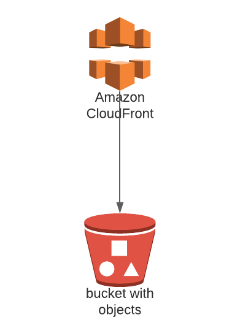
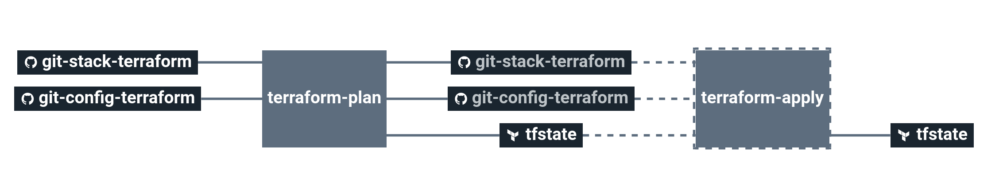
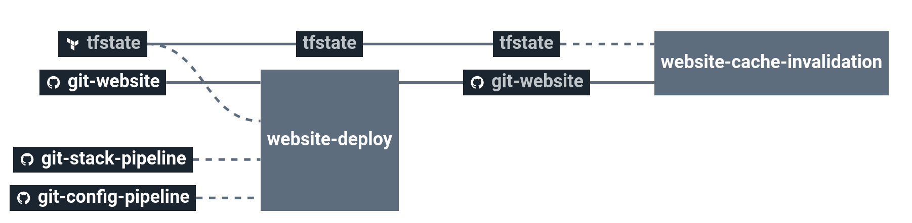

# stack-static-website

Create a AWS Cloudfront on top of AWS S3 Bucket in order to serve static website.

# Architecture

# Requirements

In order to run this task, couple elements are required within the infrastructure:

  * Having an S3 bucket with versioning to store Terraform remote states [here](https://docs.aws.amazon.com/quickstarts/latest/s3backup/step-1-create-bucket.html)

# Details

## Pipeline

> **Note** The pipeline contains a manual approval between `terraform plan` and `terraform apply`.
> That means if you trigger a `terraform plan`, to apply it, you have to go on `terraform apply` job
> and click on the `+` button to trigger it.

Infra view is composed of a terraform plan and apply to create the infrastructure.

Website view is composed of a application deployment on s3 job and cloudfront cache invalidation.

**Jobs description**

  * `terraform-plan`: Terraform job that will simply make a plan of the stack.
  * `terraform-apply`: Terraform job similar to the plan one, but will actually create/update everything that needs to. Please see the plan diff for a better understanding.
  * `terraform-destroy`: :warning: Terraform job meant to destroy the whole stack - **NO CONFIRMATION ASKED**. If triggered, the full project **WILL** be destroyed. Use with caution.
  * `website-deploy`: Used to build your website code and deploy it on AWS S3 bucket.
  * `website-cache-invalidation`: Invalidate the CloudFront cache after a deploiement

**Params**

|Name|Description|Type|Default|Required|
|---|---|:---:|:---:|:---:|
|`aws_access_key`|Amazon AWS access key for Terraform. See value format [here](https://docs.cycloid.io/advanced-guide/integrate-and-use-cycloid-credentials-manager.html#vault-in-the-pipeline).|`-`|`((aws.access_key))`|`True`|
|`aws_default_region`|Amazon AWS region to use for Terraform.|`-`|`eu-west-1`|`True`|
|`aws_secret_key`|Amazon AWS secret key for Terraform. See value format [here](https://docs.cycloid.io/advanced-guide/integrate-and-use-cycloid-credentials-manager.html#vault-in-the-pipeline).|`-`|`((aws.secret_key))`|`True`|
|`config_git_branch`|Branch of the config git repository.|`-`|`master`|`True`|
|`config_git_private_key`|SSH key pair to fetch the config git repository.|`-`|`((ssh_config.ssh_key))`|`True`|
|`config_git_repository`|Git repository URL containing the config of the stack.|`-`|`git@github.com:MyUser/config.git`|`True`|
|`config_pipeline_path`|Path of pipeline task yml files in the config Git repository. Used to override pipeline yask like build-release.yml|`-`|`($ project $)/pipeline`|`True`|
|`config_terraform_path`|Path of Terraform files in the config git repository|`-`|`($ project $)/terraform/($ environment $)`|`True`|
|`customer`|Name of the Cycloid Organization, used as customer variable name.|`-`|`($ organization_canonical $)`|`True`|
|`env`|Name of the project's environment.|`-`|`($ environment $)`|`True`|
|`project`|Name of the project.|`-`|`($ project $)`|`True`|
|`stack_git_branch`|Branch to use on the public stack git repository|`-`|`master`|`True`|
|`terraform_storage_bucket_name`|AWS S3 bucket name to store Terraform remote state file.|`-`|`($ organization_canonical $)-terraform-remote-state`|`True`|
|`website_git_branch`|Branch of the website git repository.|`-`|`master`|`True`|
|`website_git_private_key`|SSH key pair to fetch the website git repository.|`-`|`((ssh_config.ssh_key))`|`True`|
|`website_git_repository`|Git repository URL containing the website code.|`-`|`git@github.com:MyUser/website.git`|`True`|

## Terraform

**Inputs**

|Name|Description|Type|Default|Required|
|---|---|:---:|:---:|:---:|
|`cloudfront_aliases`|List of FQDN's - Used to set the Alternate Domain Names (CNAMEs) setting on Cloudfront.|`list`|`[]`|`True`|
|`cloudfront_cache_allowed_methods`|List of allowed methods (e.g. GET, PUT, POST, DELETE, HEAD) for AWS CloudFront.|`list`|`["GET", "HEAD"]`|`False`|
|`cloudfront_cache_cached_methods`|List of cached methods (e.g. GET, PUT, POST, DELETE, HEAD).|`list`|`["GET", "HEAD"]`|`False`|
|`cloudfront_certificate_arn`|ARN of Certificates Managed by ACM for ssl purpose.|`string`|`""`|`False`|
|`cloudfront_default_root_object`|Cloudfront default root object.|`string`|`"index.html"`|`False`|
|`cloudfront_default_ttl`|Default amount of time (in seconds) that an object is in a CloudFront cache.|`number`|`300`|`False`|
|`cloudfront_forward_cookies`|Specifies whether you want CloudFront to forward all or no cookies to the origin. Can be 'all' or 'none'.|`string`|`"none"`|`False`|
|`cloudfront_forward_headers`|A list of whitelisted header values to forward to the origin.|`list`|`["Access-Control-Request-Headers", "Access-Control-Request-Method", "Origin"]`|`False`|
|`cloudfront_forward_query_string`|Forward query strings to the origin that is associated with this cache behavior.|`bool`|`true`|`False`|
|`cloudfront_geo_restriction_locations`|List of country codes for which CloudFront either to distribute content (whitelist) or not distribute your content (blacklist).|`list`|`["US", "CA", "GB", "DE"]`|`False`|
|`cloudfront_geo_restriction_type`|CloudFront Method that use to restrict distribution of your content by country: `none`, `whitelist`, or `blacklist`.|`string`|`"none"`|`False`|
|`cloudfront_max_ttl`|Maximum amount of time (in seconds) that an object is in a CloudFront cache.|`number`|`604800`|`False`|
|`cloudfront_min_ttl`|Minimum amount of time that you want objects to stay in CloudFront caches.|`number`|`0`|`False`|
|`cloudfront_minimum_protocol_version`|Minimum TLS protocol version to use in a CloudFront.|`string`|`"TLSv1"`|`False`|
|`cloudfront_ordered_cache`|CloudFront An ordered list of cache behaviors resource for this distribution.|`map`|`{}`|`False`|
|`cloudfront_price_class`|Price class for this distribution: `PriceClass_All`, `PriceClass_200`, `PriceClass_100`.|`string`|`""`|`False`|
|`cloudfront_viewer_protocol_policy`|CloudFront viewer protocol policy: allow-all, redirect-to-https.|`string`|`"redirect-to-https"`|`False`|
|`cors_allowed_headers`|List of allowed headers for S3 bucket.|`list`|`["*"]`|`False`|
|`cors_allowed_methods`|List of allowed methods (e.g. GET, PUT, POST, DELETE, HEAD) for S3 bucket.|`list`|`["GET"]`|`False`|
|`cors_allowed_origins`|List of allowed origins (e.g. example.com, test.com) for S3 bucket.|`list`|`[]`|`False`|
|`cors_expose_headers`|List of expose header in the response for S3 bucket.|`list`|`["ETag"]`|`False`|
|`cors_max_age_seconds`|Time in seconds that browser can cache the response for S3 bucket.|`number`|`3600`|`False`|
|`extra_tags`|Dict of extra tags to add on aws resources.|`dict`|`{}`|`False`|
|`s3_bucket_name`|Name of the S3 bucket to create. Only lowercase alphanumeric characters and hyphens allowed.|`-`|``|`False`|

**Outputs**

| Name | Description |
|------|-------------|
| iam_s3_key | IAM access key dedicated to the S3 bucket access |
| iam_s3_secret | IAM secret key dedicated to the S3 bucket access |
| s3_id | ID of AWS S3 bucket |
| cf_id | ID of AWS CloudFront distribution |
| cf_domain_name | Domain name of AWS CloudFront distribution |

# Links

Inspired by https://github.com/cloudposse/terraform-aws-cloudfront-s3-cdn
