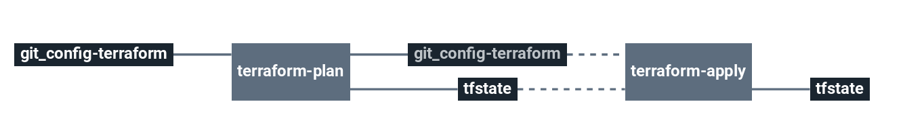

# stack-terraform-runner

This stack enables you to execute a Terraform plan and apply it to Terraform code stored in a Git repository.

# Architecture

# Requirements

In order to run this task, couple elements are required within the infrastructure:

  * Having an S3 bucket to store Terraform remote states [Here](https://docs.aws.amazon.com/quickstarts/latest/s3backup/step-1-create-bucket.html)

# Details

## Pipeline

> **Note** The pipeline contains a manual approval between terraform plan and terraform apply.
> That means if you trigger a terraform plan, to apply it, you have to go on terraform apply job
> and click on the `+` button to trigger it.

**Jobs description**

  * `terraform-plan`: Terraform job that will simply make a plan of the stack.
  * `terraform-apply`: Terraform job similar to the plan one, but will actually create/update everything that needs to. Please see the plan diff for a better understanding.
  * `terraform-destroy`: :warning: Terraform job meant to destroy the whole stack - **NO CONFIRMATION ASKED**. If triggered, the full project **WILL** be destroyed. Use with caution.

**Variations**

There are 4 versions of the pipeline supported in this stack:
  * AWS: `pipeline.yml` + `variables.sample.yml` (default)
  * GCP: `pipeline-gcp.yml` + `variables-gcp.sample.yml`
  * Azure: `pipeline-azure.yml` + `variables-azure.sample.yml`

Currently, Cycloid console doesn't support yet switching between different pipeline variations, you will have to manually copy+paste pipeline+variables from GIT inside the Cycloid console to use them.

> **Note** Don't forget to replace the following Cycloid console anchors with the proper values when using a pipeline variation (the Cycloid console does it automatically for the default one):
>   * `($ .organization_canonical $)` with your Cycloid organization name.
>   * `($ .project $)` with your Cycloid project name.
>   * `($ .environment $)` with your target Cycloid project environment name.

**Params**

***default***

|Name|Description|Type|Default|Required|
|---|---|:---:|:---:|:---:|
|`aws_access_key`|Amazon AWS access key for Terraform. See value format [here](https://docs.cycloid.io/advanced-guide/integrate-and-use-cycloid-credentials-manager.html#vault-in-the-pipeline)|`-`|`((aws.access_key))`|`True`|
|`aws_default_region`|Amazon AWS region to use for Terraform.|`-`|`eu-west-1`|`True`|
|`aws_secret_key`|Amazon AWS secret key for Terraform. See value format [here](https://docs.cycloid.io/advanced-guide/integrate-and-use-cycloid-credentials-manager.html#vault-in-the-pipeline)|`-`|`((aws.secret_key))`|`True`|
|`customer`|Name of the Cycloid Organization, used as customer variable name.|`-`|`($ .organization_canonical $)`|`True`|
|`env`|Name of the project's environment.|`-`|`($ .environment $)`|`True`|
|`git_branch`|Branch of the terraform source code Git repository.|`-`|`master`|`True`|
|`git_private_key`|SSH key pair to fetch terraform source code Git repository.|`-`|`((ssh_config.ssh_key))`|`True`|
|`git_repository`|URL to the Git repository containing terraform source code.|`-`|`git@github.com:MyUser/terraform-code.git`|`True`|
|`git_terraform_path`|Path of Terraform files in the git repository|`-`|`./`|`True`|
|`project`|Name of the project.|`-`|`($ .project $)`|`True`|
|`terraform_s3_endpoint`|A custom endpoint for the S3 API.|`-`|`''`|`True`|
|`terraform_s3_force_path_style`|Always use path-style S3 URLs (https://<HOST>/<BUCKET> instead of https://<BUCKET>.<HOST>).|`-`|`'true'`|`False`|
|`terraform_s3_skip_credentials_validation`|Skip the credentials validation via the STS API.|`-`|`'true'`|`False`|
|`terraform_storage_bucket_name`|AWS S3 bucket name to store terraform remote state file.|`-`|`($ .organization_canonical $)-terraform-remote-state`|`True`|
|`terraform_version`|terraform version used to execute your code.|`-`|`'latest'`|`True`|

***gcp***

|Name|Description|Type|Default|Required|
|---|---|:---:|:---:|:---:|
|`customer`|Name of the Cycloid Organization, used as customer variable name.|`-`|`($ .organization_canonical $)`|`True`|
|`env`|Name of the project's environment.|`-`|`($ .environment $)`|`True`|
|`gcp_credentials_json`|Google Cloud Platform credentials JSON for Terraform. See value format [here](https://docs.cycloid.io/advanced-guide/integrate-and-use-cycloid-credentials-manager.html#vault-in-the-pipeline)|`-`|`((gcp.json_key))`|`True`|
|`gcp_project`|Google Cloud Platform project to use for Terraform.|`-`|`($ .project $)`|`True`|
|`gcp_region`|Google Cloud Platform region to use for Terraform.|`-`|`europe-west1`|`True`|
|`git_branch`|Branch of the terraform source code Git repository.|`-`|`master`|`True`|
|`git_private_key`|SSH key pair to fetch terraform source code Git repository.|`-`|`((ssh_config.ssh_key))`|`True`|
|`git_repository`|URL to the Git repository containing terraform source code.|`-`|`git@github.com:MyUser/terraform-code.git`|`True`|
|`git_terraform_path`|Path of Terraform files in the git repository|`-`|`./`|`True`|
|`project`|Name of the project.|`-`|`($ .project $)`|`True`|
|`terraform_storage_bucket_name`|Google Cloud Storage bucket name to store terraform remote state file.|`-`|`($ .organization_canonical $)-terraform-remote-state`|`True`|
|`terraform_version`|terraform version used to execute your code.|`-`|`'latest'`|`True`|

***azure***

|Name|Description|Type|Default|Required|
|---|---|:---:|:---:|:---:|
|`azure_client_id`|Azure client ID to use for Terraform.|`-`|`((azure.client_id))`|`True`|
|`azure_client_secret`|Azure client secret to use for Terraform.|`-`|`((azure.client_secret))`|`True`|
|`azure_env`|Azure environment to use for Terraform. Can be either `public`, `usgovernment`, `german` or `china`.|`-`|`public`|`True`|
|`azure_location`|Azure location to use for terraform. |`-`|`West Europe`|`True`|
|`azure_subscription_id`|Azure subscription ID to use for Terraform.|`-`|`((azure.subscription_id))`|`True`|
|`azure_tenant_id`|Azure tenant ID to use for Terraform.|`-`|`((azure.tenant_id))`|`True`|
|`customer`|Name of the Cycloid Organization, used as customer variable name.|`-`|`($ .organization_canonical $)`|`True`|
|`env`|Name of the project's environment.|`-`|`($ .environment $)`|`True`|
|`git_branch`|Branch of the terraform source code Git repository.|`-`|`master`|`True`|
|`git_private_key`|SSH key pair to fetch terraform source code Git repository.|`-`|`((ssh_config.ssh_key))`|`True`|
|`git_repository`|URL to the Git repository containing terraform source code.|`-`|`git@github.com:MyUser/terraform-code.git`|`True`|
|`git_terraform_path`|Path of Terraform files in the git repository|`-`|`./`|`True`|
|`project`|Name of the project.|`-`|`($ .project $)`|`True`|
|`terraform_resource_group_name`|Azure Resource Group of the Storage Account to use to store terraform remote state file.|`-`|`($ .organization_canonical $)-terraform`|`True`|
|`terraform_storage_account_key`|Azure Storage Account key to use to store terraform remote state file.|`-`|`((azure_storage.access_key))`|`True`|
|`terraform_storage_account_name`|Azure Storage Account name to use to store terraform remote state file.|`-`|`((azure_storage.account_name))`|`True`|
|`terraform_storage_container_name`|Azure Storage container name to store terraform remote state file.|`-`|`($ .organization_canonical $)`|`True`|
|`terraform_storage_container_path`|Azure Storage container path to store terraform remote state file.|`-`|`($ .project $)/($ .environment $)`|`True`|
|`terraform_version`|terraform version used to execute your code.|`-`|`'latest'`|`True`|
